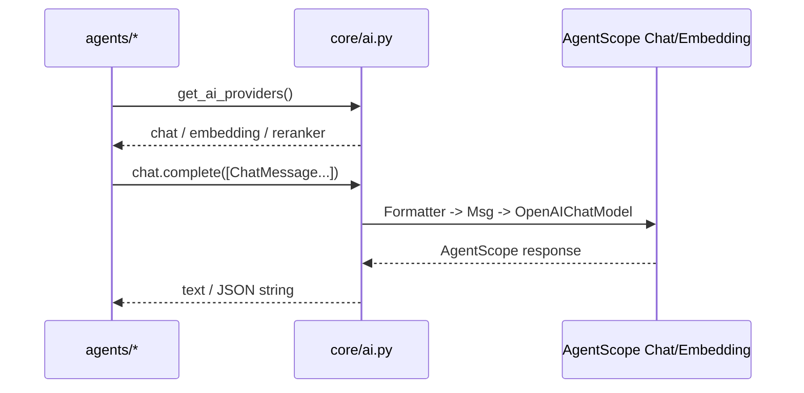
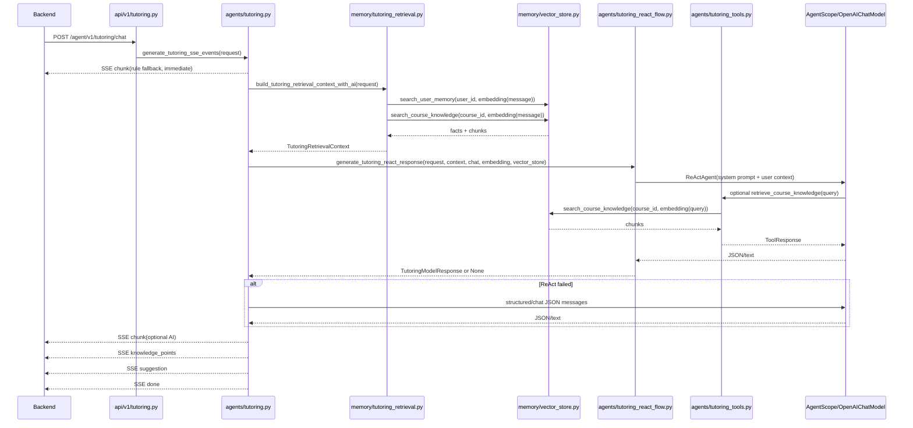
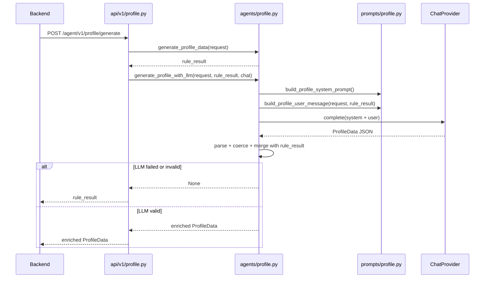
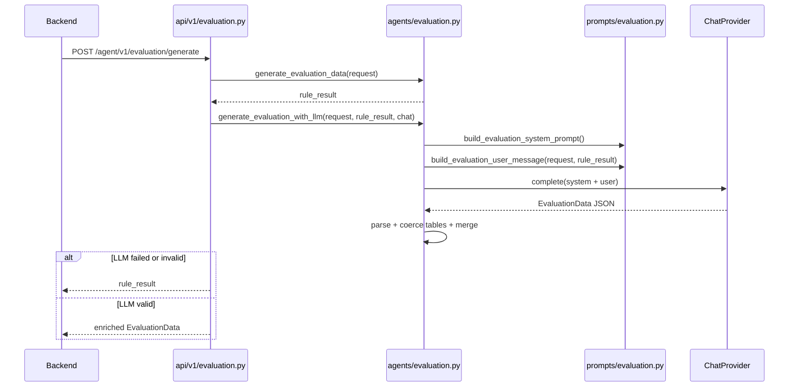
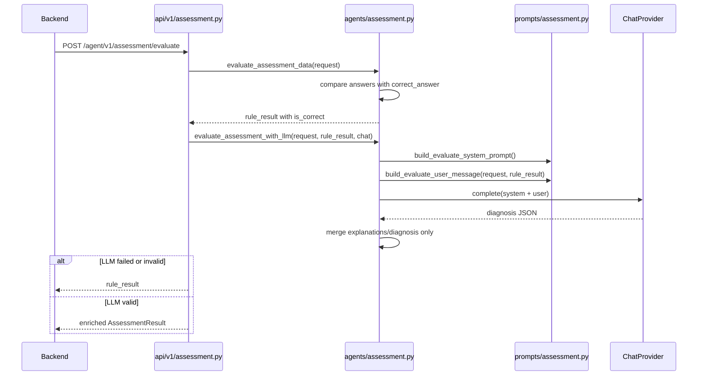
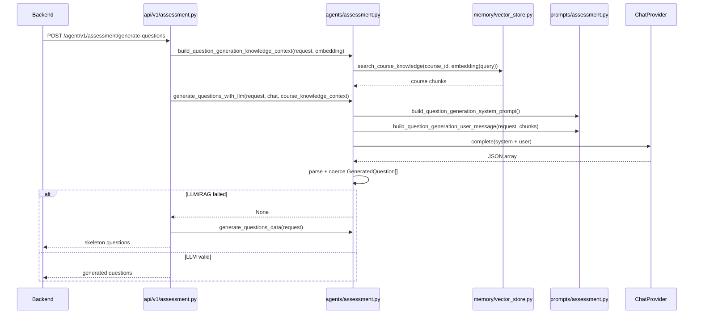
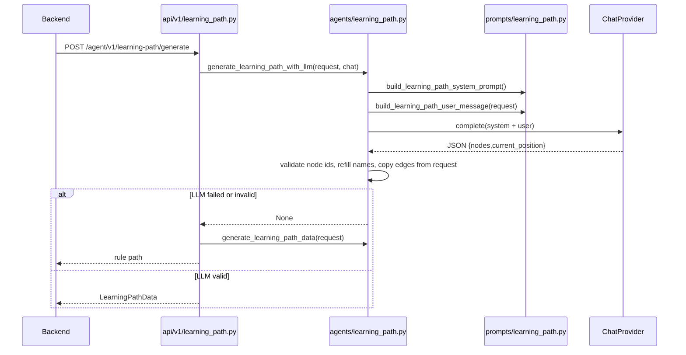
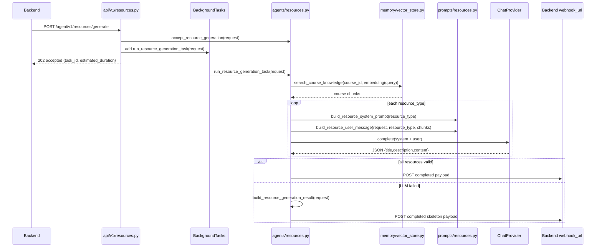
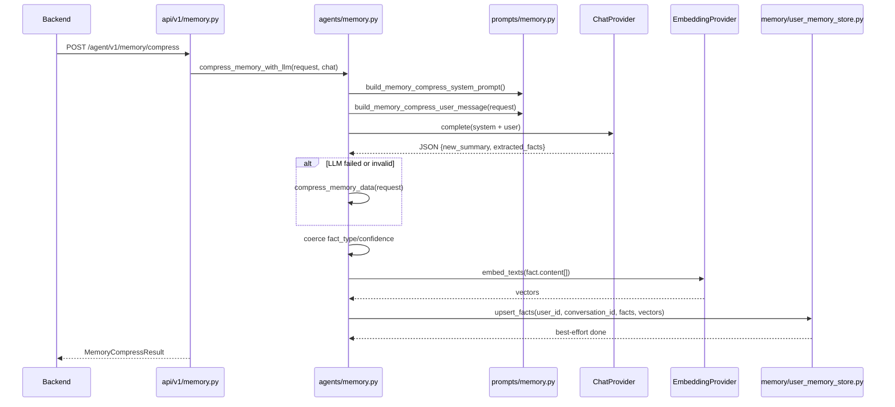

# Agent Service AI 编排审计文档

本文用于审计和调整 `agent_service` 当前 AI/AgentScope/RAG 编排。重点回答三个问题：

1. 每个功能的 AI 编排入口在哪里。
2. AI 实际接收了什么输入，包括 prompt、请求字段、RAG 片段、用户长期记忆。
3. 哪些位置可以自定义审核、替换或收紧。

本文只描述当前代码现状，不作为接口契约来源。接口契约仍以：

- `../docs/20-agent-api/Agent-Service.openapi.json`
- `../docs/20-agent-api/API_Agent内部接口规范.md`

为准。

## 1. 总体编排边界

### 1.1 分层位置

| 层 | 作用 | 主要文件 |
|---|---|---|
| API 路由 | 接收 FastAPI 请求、包装响应、SSE/后台任务协议适配 | `api/v1/*.py` |
| Agent 编排 | 规则版逻辑、LLM 调用、AgentScope ReAct 编排、fallback 链 | `agents/*.py` |
| Prompt | 构造 system/user message 文本 | `prompts/*.py` |
| AI Provider | 把项目内部 `ChatMessage` 转成 AgentScope model 输入，构建 chat/embedding/reranker | `core/ai.py` |
| RAG / Memory | Qdrant 检索、课程知识、用户长期记忆写入 | `memory/*.py` |
| 运维工具 | 知识摄入、readiness、smoke | `tools/*.py` |

### 1.2 AI Provider 调用形态

公共 AI provider 构建在 `core/ai.py`：

- `get_ai_providers()` 返回 `AIProviders(embedding, reranker, chat)`。
- `AgentScopeChatProvider.complete(messages, structured_model=None)` 接收项目内 `ChatMessage` 列表。
- `AgentScopeChatProvider` 内部使用：
  - `agentscope.model.OpenAIChatModel`
  - `agentscope.formatter.DeepSeekChatFormatter`
  - `agentscope.message.Msg`
- `AgentScopeEmbeddingProvider.embed_texts(texts)` 用于生成向量。
- `OpenAICompatibleRerankerProvider.score(query, documents)` 用于重排 RAG 结果。

### 1.3 当前 AI 功能总表

| 功能 | 是否调用 LLM | 是否使用 RAG | 是否使用 AgentScope ReAct | 主要编排文件 | Prompt 文件 |
|---|---:|---:|---:|---|---|
| `POST /agent/v1/tutoring/chat` | 是 | 是，用户记忆 + 课程知识 | 是 | `agents/tutoring.py`, `agents/tutoring_react_flow.py`, `agents/tutoring_react.py`, `agents/tutoring_tools.py` | `prompts/tutoring.py` |
| `POST /agent/v1/profile/generate` | 是 | 否 | 否 | `agents/profile.py` | `prompts/profile.py` |
| `POST /agent/v1/evaluation/generate` | 是 | 否 | 否 | `agents/evaluation.py` | `prompts/evaluation.py` |
| `POST /agent/v1/assessment/evaluate` | 是 | 否 | 否 | `agents/assessment.py` | `prompts/assessment.py` |
| `POST /agent/v1/assessment/generate-questions` | 是 | 是，课程知识 | 否 | `agents/assessment.py` | `prompts/assessment.py` |
| `POST /agent/v1/learning-path/generate` | 是 | 否 | 否 | `agents/learning_path.py` | `prompts/learning_path.py` |
| `POST /agent/v1/resources/generate` | 是 | 是，课程知识 | 否 | `agents/resources.py` | `prompts/resources.py` |
| `POST /agent/v1/memory/compress` | 是 | 写入用户记忆，不检索 | 否 | `agents/memory.py` | `prompts/memory.py` |
| `GET /agent/v1/health` | 否 | Qdrant 探针 | 否 | `agents/health.py` | 无 |

## 2. 智能辅导 `POST /agent/v1/tutoring/chat`

### 2.1 文件位置

| 职责 | 文件 |
|---|---|
| API 路由 | `api/v1/tutoring.py` |
| SSE 事件总编排 | `agents/tutoring.py` 的 `generate_tutoring_sse_events()` |
| 规则版结果构造 | `agents/tutoring.py` 的 `build_tutoring_generation_result()` |
| 普通 chat JSON 路径 | `agents/tutoring.py` 的 `generate_tutoring_model_response()` |
| ReAct 胶水层 | `agents/tutoring_react_flow.py` |
| ReActAgent 适配器 | `agents/tutoring_react.py` |
| ReAct 工具集 | `agents/tutoring_tools.py` |
| Prompt 构造 | `prompts/tutoring.py` |
| 检索上下文构造 | `memory/tutoring_retrieval.py` |
| Qdrant 检索 | `memory/vector_store.py` |

### 2.2 AI 实际接收什么

#### A. ReActAgent 路径

入口：`agents/tutoring_react_flow.py` 的 `generate_tutoring_react_response()`。

AI system prompt 来自 `prompts/tutoring.py` 的 `TUTOR_REACT_SYSTEM_PROMPT`，核心要求：

- 角色：`EDUagent 的智能辅导 Agent`
- 基于 ReActAgent 推理循环
- 回答贴合用户画像、课程范围和检索上下文
- 输出 JSON object
- 字段：`model_text`, `knowledge_points`, `suggestion`

AI user message 由 `_build_react_user_message()` 拼接，实际包含：

| 输入来源 | 实际注入内容 |
|---|---|
| `request.user_id` | `用户ID：...` |
| `request.course_id` | `课程ID：...`，无课程时写“全局” |
| `request.user_profile.guidance_level` | `引导粒度：L1/L2/L3` |
| `request.user_profile.knowledge_weak` | `薄弱点：...` |
| `request.user_profile.knowledge_mastered` | `已掌握：...` |
| `request.conversation_summary` | `会话摘要：...` |
| `retrieval_context.user_memory_facts` | `长期记忆：...` |
| `retrieval_context.course_knowledge_chunks` | `课程知识：...` |
| `request.recent_messages` | 每条拼为 `[role] content` |
| `request.message` | `当前问题：...` |

ReAct toolkit 在 embedding provider 和 vector store 都可用时挂载，模型能看到两个工具：

| 工具 | 文件 | 模型可见签名 | 实际行为 |
|---|---|---|---|
| `retrieve_course_knowledge` | `agents/tutoring_tools.py` | `query: str` | query 向量化后查 `course_knowledge` collection |
| `retrieve_user_memory` | `agents/tutoring_tools.py` | `query: str` | query 向量化后查 `user_memory` collection |

注意：`course_id`、`user_id`、embedding provider、vector store 都由闭包隐藏，模型只传 `query`。

#### B. 普通 chat JSON / structured output 路径

入口：`agents/tutoring.py` 的 `generate_tutoring_model_response()`。

AI messages 由 `prompts/tutoring.py` 的 `build_tutoring_messages()` 构造：

- system message：
  - 角色为智能辅导 Agent
  - 要求贴合用户画像、课程范围和检索上下文
  - 要求 JSON object
  - 字段：`model_text`, `knowledge_points`, `suggestion`
- recent messages：
  - 直接把 `request.recent_messages` 转成 `ChatMessage(role=item.role, content=item.content)`
- user message：
  - 用户 ID
  - 课程 ID
  - 引导粒度
  - 薄弱点
  - 已掌握
  - 会话摘要
  - 长期记忆
  - 课程知识
  - 当前问题

调用顺序：

1. 优先 `chat_provider.complete(messages, structured_model=_TutoringStructuredOutput)`。
2. structured output 失败后调用 `chat_provider.complete(messages)`。
3. 输出由 `parse_tutoring_model_response()` 解析：
   - 整段 JSON
   - `<agent_result>...</agent_result>`
   - 否则原始文本作为 `model_text`

### 2.3 RAG 实际输入和输出

RAG 构造在 `memory/tutoring_retrieval.py`：

| 步骤 | 文件/函数 | 输入 | 输出 |
|---|---|---|---|
| 基础上下文 | `build_tutoring_retrieval_context()` | `TutoringChatRequest` | 画像中的薄弱点/掌握点 |
| 向量化 query | `build_tutoring_retrieval_context_with_ai()` | `request.message` | `query_vector` |
| 用户记忆检索 | `QdrantVectorStore.search_user_memory()` | `user_id`, `query_vector` | `user_memory_facts` |
| 课程知识检索 | `QdrantVectorStore.search_course_knowledge()` | `course_id`, `query_vector` | `course_knowledge_chunks` |
| 可选重排 | `_rerank_texts()` | `request.message`, docs | 重排后的文本 |

### 2.4 fallback 链

当前 SSE 会先立即发送一个规则版 `chunk`，再尝试 RAG/AI 路径：

1. `build_tutoring_generation_result(request)` 生成 fallback chunk 并先发出。
2. 尝试 embedding + Qdrant 构造检索上下文。
3. 尝试 ReActAgent。
4. ReAct 失败后尝试普通 chat JSON / structured output。
5. 如果 AI 有 `model_text`，再发送一个 AI chunk。
6. 最后发送 `knowledge_points`、`suggestion`、`done`。

### 2.5 顺序图

### 2.6 可审核调整点

| 想调整的内容 | 修改位置 |
|---|---|
| ReAct 系统提示词 | `prompts/tutoring.py` 的 `TUTOR_REACT_SYSTEM_PROMPT` |
| 普通 chat JSON 提示词 | `prompts/tutoring.py` 的 `build_tutoring_messages()` |
| ReAct 输入拼接 | `agents/tutoring_react_flow.py` 的 `_build_react_user_message()` |
| 是否先发规则版 chunk | `agents/tutoring.py` 的 `generate_tutoring_sse_events()` |
| 工具名称、工具描述、检索 limit | `agents/tutoring_tools.py` |
| RAG query 文本 | `memory/tutoring_retrieval.py` |
| 解析 LLM 输出 | `agents/tutoring.py` 的 `parse_tutoring_model_response()` |

## 3. 用户画像 `POST /agent/v1/profile/generate`

### 3.1 文件位置

| 职责 | 文件 |
|---|---|
| API 路由 | `api/v1/profile.py` |
| 规则版画像 | `agents/profile.py` 的 `generate_profile_data()` |
| LLM enrichment | `agents/profile.py` 的 `generate_profile_with_llm()` |
| Prompt | `prompts/profile.py` |
| 输出保护/合并 | `agents/profile.py` 的 `_enrich_profile_result()` 及 `_coerce_*()` |

### 3.2 AI 实际接收什么

AI messages：

1. system：`build_profile_system_prompt()`
2. user：`build_profile_user_message(request, rule_result)`

system prompt 要求输出完整 `ProfileData` JSON，字段包括：

- `modal_preference`
- `guidance_level_suggestion`
- `knowledge_coordinates`
- `cognitive_blindspots`
- `drive_intent`
- `discipline_badge`

user message 实际包含：

| 输入来源 | 实际注入内容 |
|---|---|
| `request.user_id` | 用户 ID |
| `request.course_id` | 课程 ID |
| `request.quiz_history` | 每条练习记录：章节、正确率、时间 |
| quiz summary | 平均正确率、首次记录、最近记录、低于 70% 的条数 |
| `request.resource_usage_stats` | 视频/文档/代码/做题次数 |
| `request.drive_intent_data` | 近 7 天学习次数、学习时长 |
| `rule_result` | 系统已计算画像：引导级别、知识坐标、认知盲区、驱动意图、学科徽章 |

### 3.3 输出保护

LLM 输出不是直接返回，而是经过 `agents/profile.py` 的 schema-aware 合并：

- 不允许编造输入中没出现的章节/知识点。
- `knowledge_coordinates` 和 `cognitive_blindspots` 只接受 observed names。
- 枚举值不合法则回落到规则版。
- 0-100 数值会 clamp。
- 缺失字段沿用 `rule_result`。

### 3.4 顺序图

### 3.5 可审核调整点

| 想调整的内容 | 修改位置 |
|---|---|
| 画像字段生成要求 | `prompts/profile.py` 的 `build_profile_system_prompt()` |
| 输入给 LLM 的统计摘要 | `prompts/profile.py` 的 `build_profile_user_message()` |
| 允许 LLM 改哪些字段 | `agents/profile.py` 的 `_enrich_profile_result()` |
| 防止编造知识点 | `agents/profile.py` 的 `_observed_profile_names()` 和 `_coerce_*()` |

## 4. 学习效果评估 `POST /agent/v1/evaluation/generate`

### 4.1 文件位置

| 职责 | 文件 |
|---|---|
| API 路由 | `api/v1/evaluation.py` |
| 规则版评估 | `agents/evaluation.py` 的 `generate_evaluation_data()` |
| LLM enrichment | `agents/evaluation.py` 的 `generate_evaluation_with_llm()` |
| Prompt | `prompts/evaluation.py` |
| 输出保护/表格合并 | `agents/evaluation.py` 的 `_coerce_*_table()` |

### 4.2 AI 实际接收什么

AI messages：

1. system：`build_evaluation_system_prompt()`
2. user：`build_evaluation_user_message(request, rule_result)`

system prompt 要求输出完整 `EvaluationData` JSON：

- `progress_table`
- `mastery_table`
- `resource_usage_table`
- `summary_text`

user message 实际包含：

| 输入来源 | 实际注入内容 |
|---|---|
| `request.user_id` | 用户 ID |
| `request.course_id` | 课程 ID |
| `request.learning_progress.chapter_progress` | 每章完成率、学习时长 |
| `request.quiz_results` | 每次练习的章节、正确率、时间，并按时间排序 |
| `rule_result.mastery_table` | 规则版掌握度摘要 |
| `request.resource_usage.by_type` | 各资源类型使用次数 |
| `rule_result.summary_text` | 当前规则版总结 |

### 4.3 输出保护

LLM 输出经过表格级保护：

- `chapter` 必须来自学习进度或练习结果中出现过的章节。
- `resource_type` 必须来自输入资源类型。
- `completion_rate`、`average_score` clamp 到 0-100。
- `time_spent`、`quiz_count`、`count` 必须是非负整数。
- 只允许特定额外列：
  - `progress_insight`
  - `root_cause`
  - `effectiveness_hint`
- 表格无有效行时回落规则版表格。

### 4.4 顺序图

### 4.5 可审核调整点

| 想调整的内容 | 修改位置 |
|---|---|
| 是否允许 LLM 增加新表格列 | `agents/evaluation.py` 的 `_ALLOWED_EXTRA_COLUMNS` |
| 表格行的合法性规则 | `agents/evaluation.py` 的 `_coerce_progress_table()` 等 |
| 给 LLM 的学习趋势摘要 | `prompts/evaluation.py` |
| summary 的风格要求 | `prompts/evaluation.py` 的 system prompt |

## 5. 测验评估 `POST /agent/v1/assessment/evaluate`

### 5.1 文件位置

| 职责 | 文件 |
|---|---|
| API 路由 | `api/v1/assessment.py` |
| 规则判分 | `agents/assessment.py` 的 `evaluate_assessment_data()` |
| LLM 诊断增强 | `agents/assessment.py` 的 `evaluate_assessment_with_llm()` |
| Prompt | `prompts/assessment.py` |
| 输出合并 | `agents/assessment.py` 的 `_enrich_rule_result()` |

### 5.2 AI 实际接收什么

AI messages：

1. system：`build_evaluate_system_prompt()`
2. user：`build_evaluate_user_message(request, rule_result)`

重要边界：`is_correct` 判分由规则版确定，LLM 不负责改判分。

user message 实际包含：

| 输入来源 | 实际注入内容 |
|---|---|
| `request.user_id` | 用户 ID |
| `request.course_id` | 课程 ID |
| `request.user_mastery` | JSON 字符串形式的用户掌握度 |
| `request.questions` | 题目 ID、题型、题目内容、标准答案、知识点 |
| `request.answers` | 用户答案 |
| `rule_result.per_question_results` | 每题规则判分结果：正确/错误 |

### 5.3 LLM 可影响什么

LLM 输出会被合并到规则结果中：

- 可覆盖每题 `explanation`。
- 可补充 `related_knowledge_points`。
- 可覆盖 `diagnosis.summary`。
- 可补充/替换 weak point 的 `error_pattern`。
- 可替换 `diagnosis.suggestions`。

LLM 不可影响：

- `is_correct`
- 题目数量
- 题目顺序
- 题目 ID

### 5.4 顺序图

### 5.5 可审核调整点

| 想调整的内容 | 修改位置 |
|---|---|
| LLM 诊断风格 | `prompts/assessment.py` 的 `build_evaluate_system_prompt()` |
| 输入给 LLM 的题目/答案字段 | `prompts/assessment.py` 的 `build_evaluate_user_message()` |
| LLM 是否能改 suggestions | `agents/assessment.py` 的 `_enrich_suggestions()` |
| LLM 是否能改 related_knowledge_points | `agents/assessment.py` 的 `_enrich_rule_result()` |

## 6. 题目生成 `POST /agent/v1/assessment/generate-questions`

### 6.1 文件位置

| 职责 | 文件 |
|---|---|
| API 路由 | `api/v1/assessment.py` |
| 规则版骨架题 | `agents/assessment.py` 的 `generate_questions_data()` |
| 课程知识 RAG | `agents/assessment.py` 的 `build_question_generation_knowledge_context()` |
| LLM 出题 | `agents/assessment.py` 的 `generate_questions_with_llm()` |
| Prompt | `prompts/assessment.py` |

### 6.2 AI 实际接收什么

LLM 出题 messages：

1. system：`build_question_generation_system_prompt()`
2. user：`build_question_generation_user_message(request, course_knowledge_context)`

user message 实际包含：

| 输入来源 | 实际注入内容 |
|---|---|
| `request.knowledge_point` | 知识点，缺省为“综合” |
| `request.question_types` | 题型列表，缺省为 `single_choice` |
| `request.count` | 题目数量 |
| `request.difficulty` | 难度，缺省为 `medium` |
| `request.chapter` | 章节，缺省为“不限” |
| `request.personalization_context.wrong_points` | 个性化上下文里的薄弱知识点 |
| `course_knowledge_context` | 课程知识库检索片段 |

### 6.3 RAG 实际输入和输出

RAG 构造在 `agents/assessment.py` 的 `build_question_generation_knowledge_context()`：

| 步骤 | 输入 | 输出 |
|---|---|---|
| query 构造 | `knowledge_point + chapter + course_id` | query text |
| embedding | query text | query vector |
| Qdrant 检索 | `course_id`, query vector, limit=5 | 课程知识片段 |
| 截断 | 每段最多 1000 字符 | `course_knowledge_context` |
| 拼接 | `\n---\n` | 注入 prompt 的课程参考资料 |

### 6.4 输出解析

LLM 必须返回 JSON 数组。每个元素被转成 `GeneratedQuestion`：

- `type`
- `content`
- `options`
- `answer`
- `explanation`
- `chapter`
- `knowledge_point`
- `difficulty`

当前 `_coerce_questions()` 主要做结构兜底，不严格校验题目数量、答案格式和选项质量；质量主要靠 prompt 约束。

### 6.5 顺序图

### 6.6 可审核调整点

| 想调整的内容 | 修改位置 |
|---|---|
| 出题质量要求 | `prompts/assessment.py` 的 `build_question_generation_system_prompt()` |
| RAG query | `agents/assessment.py` 的 `build_question_generation_knowledge_context()` |
| RAG limit / chunk 截断 | `build_question_generation_knowledge_context(limit=5)`, `_truncate_chunk()` |
| 题目结构校验强度 | `agents/assessment.py` 的 `_coerce_questions()` |
| 规则版 skeleton | `agents/assessment.py` 的 `generate_questions_data()` |

## 7. 学习路径 `POST /agent/v1/learning-path/generate`

### 7.1 文件位置

| 职责 | 文件 |
|---|---|
| API 路由 | `api/v1/learning_path.py` |
| 规则版路径 | `agents/learning_path.py` 的 `generate_learning_path_data()` |
| LLM 路径规划 | `agents/learning_path.py` 的 `generate_learning_path_with_llm()` |
| Prompt | `prompts/learning_path.py` |
| 输出保护 | `agents/learning_path.py` 的 `_coerce_path_nodes()` |

### 7.2 AI 实际接收什么

AI messages：

1. system：`build_learning_path_system_prompt()`
2. user：`build_learning_path_user_message(request)`

system prompt 要求：

- 输出 JSON object
- `nodes` 数组：`{id, status, mastery, order, reason}`
- `current_position`: `{node_id}`
- 不输出 `name`
- 节点 `id` 必须来自输入图谱

user message 实际包含：

| 输入来源 | 实际注入内容 |
|---|---|
| `request.knowledge_graph.nodes` | 每个节点的 `id`, `name`, `chapter` |
| `request.knowledge_graph.edges` | 依赖边 `from -> to` |
| `request.profile` | JSON 格式用户画像 |
| `request.evaluation` | JSON 格式学习评估 |

### 7.3 输出保护

LLM 只能决定已有节点的：

- `status`
- `mastery`
- `order`
- `reason`
- `current_position`

系统强制：

- `node.id` 必须在输入图谱中。
- `node.name` 从原始 `KnowledgeGraphNode` 回填，不使用 LLM 生成的 name。
- edges 直接来自输入图谱，不由 LLM 生成。
- status 不合法则变为 `pending`。
- mastery clamp 到 0-100。

### 7.4 顺序图

### 7.5 可审核调整点

| 想调整的内容 | 修改位置 |
|---|---|
| 路径规划标准 | `prompts/learning_path.py` 的 system prompt |
| 给 LLM 的 profile/evaluation 格式 | `prompts/learning_path.py` 的 `build_learning_path_user_message()` |
| 是否允许 LLM 生成新节点 | 当前不允许；如要开放，需改 `_coerce_path_nodes()` 和契约 |
| 规则版推荐策略 | `agents/learning_path.py` 的 `_node_status()` |

## 8. 资源生成 `POST /agent/v1/resources/generate`

### 8.1 文件位置

| 职责 | 文件 |
|---|---|
| API 路由 | `api/v1/resources.py` |
| 202 接收响应 | `agents/resources.py` 的 `accept_resource_generation()` |
| 后台任务编排 | `agents/resources.py` 的 `run_resource_generation_task()` |
| 规则版资源骨架 | `agents/resources.py` 的 `build_resource_generation_result()` |
| 课程知识 RAG | `agents/resources.py` 的 `_build_course_knowledge_context()` |
| LLM 生成资源 | `agents/resources.py` 的 `generate_resources_with_llm()` |
| Prompt | `prompts/resources.py` |
| Webhook | `agents/resources.py` 的 `send_webhook_with_retry()` |

### 8.2 AI 实际接收什么

资源生成是异步协议：

1. API 立即返回 202。
2. 后台任务尝试 RAG + LLM。
3. 完成后 POST `webhook_url`。

LLM 每种资源类型单独调用一次 `_generate_single_resource()`。

AI messages：

1. system：`build_resource_system_prompt(resource_type)`
2. user：`build_resource_user_message(request, resource_type, course_knowledge_context)`

system prompt 根据资源类型变化：

| resource_type | 要求 |
|---|---|
| `document` | markdown 知识讲解，包含概念定义、关键公式、例题 |
| `mindmap` | markdown 列表树形结构 |
| `reading` | markdown 拓展阅读，包含背景知识和延伸思考 |
| `code` | 带注释的可运行代码，使用 markdown 代码块 |

user message 实际包含：

| 输入来源 | 实际注入内容 |
|---|---|
| `request.course_id` | 课程 ID |
| `request.chapter` | 章节，缺省“课程整体” |
| `request.knowledge_point` | 知识点，缺省“综合” |
| 当前 `resource_type` | 资源类型 |
| `course_knowledge_context` | 课程知识库检索片段 |

### 8.3 RAG 实际输入和输出

RAG 构造在 `_build_course_knowledge_context()`：

| 步骤 | 输入 | 输出 |
|---|---|---|
| query 构造 | `request.chapter + request.knowledge_point`，都没有则用 `course_id` | query text |
| embedding | query text | query vector |
| Qdrant 检索 | `course_id`, query vector, limit=5 | chunks |
| 截断 | 每段最多 1000 字符 | chunks |
| 拼接 | `\n---\n` | `course_knowledge_context` |

### 8.4 fallback 链

1. 无 chat provider：返回 `None`。
2. 请求中含非 v1 类型，例如 `video`：整体返回 `None`。
3. 任一资源类型 LLM 失败：整体返回 `None`。
4. `run_resource_generation_task()` 使用规则版 skeleton payload。
5. 若前置构造异常，发送 failed webhook payload。
6. webhook 发送失败会重试，最终失败只记录 warning。

### 8.5 顺序图

### 8.6 可审核调整点

| 想调整的内容 | 修改位置 |
|---|---|
| 支持哪些资源类型 | `agents/resources.py` 的 `_V1_RESOURCE_TYPES` 和 `DEFAULT_RESOURCE_TYPES` |
| 每类资源的生成要求 | `prompts/resources.py` 的 `build_resource_system_prompt()` |
| 给 LLM 的课程上下文 | `prompts/resources.py` 的 `build_resource_user_message()` |
| RAG query / limit / 截断 | `agents/resources.py` 的 `_build_course_knowledge_context()` |
| 是否允许单资源失败但其他资源成功 | 当前整体 fallback；可改 `generate_resources_with_llm()` |
| webhook payload 结构 | `agents/resources.py` 的 payload 构造函数 |

## 9. 记忆压缩 `POST /agent/v1/memory/compress`

### 9.1 文件位置

| 职责 | 文件 |
|---|---|
| API 路由 | `api/v1/memory.py` |
| 规则版压缩 | `agents/memory.py` 的 `compress_memory_data()` |
| LLM 压缩 | `agents/memory.py` 的 `compress_memory_with_llm()` |
| Qdrant 持久化 | `agents/memory.py` 的 `compress_and_persist_memory()` |
| 用户记忆写入 | `memory/user_memory_store.py` |
| Prompt | `prompts/memory.py` |

### 9.2 AI 实际接收什么

AI messages：

1. system：`build_memory_compress_system_prompt()`
2. user：`build_memory_compress_user_message(request)`

system prompt 要求输出 JSON object：

- `new_summary`
- `extracted_facts`
  - `content`
  - `fact_type`
  - `knowledge_point`
  - `confidence`

允许的 `fact_type`：

- `blind_spot`
- `mastered_point`
- `cognitive_preference`

user message 实际包含：

| 输入来源 | 实际注入内容 |
|---|---|
| `request.old_summary` | 旧摘要 |
| `request.messages_to_compress` | 每条待压缩消息：序号、角色、时间、内容 |
| `request.existing_facts` | 已存在事实，要求不要重复提取 |

### 9.3 持久化路径

LLM 或规则版得到 `MemoryCompressResult` 后，`compress_and_persist_memory()` 会：

1. 取 `result.extracted_facts`。
2. 用 embedding provider 对每条 `fact.content` 向量化。
3. 调用 `QdrantUserMemoryStore.upsert_facts()`。
4. 写入失败只记录 warning，不影响接口返回。

### 9.4 顺序图

### 9.5 可审核调整点

| 想调整的内容 | 修改位置 |
|---|---|
| 摘要/事实抽取标准 | `prompts/memory.py` |
| fact 类型白名单 | `agents/memory.py` 的 `_VALID_FACT_TYPES` |
| LLM 输出清洗 | `agents/memory.py` 的 `_coerce_memory_compress_result()` |
| 规则版事实提取 | `agents/memory.py` 的 `_extract_*_fact()` |
| 记忆写入策略 | `agents/memory.py` 的 `compress_and_persist_memory()` |

## 10. 课程知识摄入和检索基础设施

### 10.1 课程知识摄入

| 职责 | 文件 |
|---|---|
| CLI 入口 | `tools/ingest_knowledge.py` |
| 文件读取与切片 | `memory/course_knowledge_ingestion.py` |
| Qdrant 写入 | `memory/course_knowledge_store.py` |

当前支持：

- PDF：AgentScope `PDFReader`
- Markdown/TXT：AgentScope `TextReader`
- 每个源文件生成 chunks
- embedding 后写入 `course_knowledge` collection
- 摄入幂等，重复源文件会跳过

### 10.2 检索基础设施

| Collection | 用途 | 相关文件 |
|---|---|---|
| `course_knowledge` / configured course collection | 课程资料 RAG | `memory/vector_store.py`, `memory/course_knowledge_store.py` |
| `user_memory` / configured user collection | 用户长期语义记忆 | `memory/vector_store.py`, `memory/user_memory_store.py` |

`memory/qdrant_store.py` 使用 AgentScope `QdrantStore` 构建底层 store，并按 `settings.EMBEDDING_DIMENSION` 创建 collection。

## 11. 自定义审核清单

### 11.1 Prompt 审核

| 功能 | Prompt 文件 | 建议检查 |
|---|---|---|
| tutoring | `prompts/tutoring.py` | 是否过早要求 JSON、是否适合 ReAct、是否需要更强引导策略 |
| profile | `prompts/profile.py` | 是否允许 LLM 改太多画像字段、reason 是否足够证据化 |
| evaluation | `prompts/evaluation.py` | summary 是否要求过宽、表格额外列是否必要 |
| assessment | `prompts/assessment.py` | 出题质量约束、诊断建议粒度 |
| learning-path | `prompts/learning_path.py` | 路径排序策略、是否尊重图谱前置边 |
| resources | `prompts/resources.py` | 每类资源内容结构、是否要引用课程片段 |
| memory | `prompts/memory.py` | fact 类型、重复事实过滤、置信度标准 |

### 11.2 RAG 审核

| 问题 | 当前位置 | 当前行为 |
|---|---|---|
| tutoring query 是什么 | `memory/tutoring_retrieval.py` | 使用 `request.message` |
| question generation query 是什么 | `agents/assessment.py` | `knowledge_point + chapter + course_id` |
| resources query 是什么 | `agents/resources.py` | `chapter + knowledge_point`，否则 `course_id` |
| 每段截断多少 | `agents/assessment.py`, `agents/resources.py` | 1000 字符 |
| 检索数量 | 多数默认 `limit=3` 或 `limit=5` | tutoring 3，出题/资源 5 |
| 用户记忆是否进入 tutoring | `memory/tutoring_retrieval.py` | 是，检索后注入 context |
| 用户记忆是否进入其他接口 | 当前无 | profile/evaluation 等未检索 user_memory |

### 11.3 Fallback 审核

| 功能 | fallback |
|---|---|
| tutoring | 规则版 chunk + ReAct 失败转普通 chat + chat 失败保留规则版 |
| profile | LLM 失败返回规则版画像 |
| evaluation | LLM 失败返回规则版表格和 summary |
| assessment/evaluate | 规则判分永远保留，LLM 只增强说明 |
| assessment/generate-questions | LLM/RAG 失败返回 skeleton 题 |
| learning-path | LLM 失败返回规则版路径 |
| resources | LLM 失败返回 skeleton resources，并 webhook completed |
| memory/compress | LLM 失败返回规则版压缩；Qdrant 写入 best-effort |

### 11.4 高风险调整点

这些位置修改后应补测试或运行对应测试：

| 调整点 | 风险 | 建议测试 |
|---|---|---|
| `core/ai.py` provider 构造 | 影响所有 LLM/RAG 接口 | `tests/test_ai_providers.py`, `tests/test_readiness.py` |
| `agents/tutoring.py` SSE 事件顺序 | 影响 Backend SSE 消费 | `tests/test_tutoring_api.py`, `tests/test_smoke_tutoring_api.py` |
| `agents/tutoring_react_flow.py` ReAct 输入 | 影响 tutoring 主链路质量 | `tests/test_tutoring_react_flow.py`, `tests/test_tutoring_tools.py` |
| `memory/vector_store.py` payload text key | 影响所有 RAG 内容 | `tests/test_vector_store.py` |
| `agents/assessment.py` 出题 coercion | 影响题目契约 | `tests/test_assessment_agent.py`, `tests/test_openapi_alignment.py` |
| `agents/resources.py` webhook payload | 影响 Backend 异步任务闭环 | `tests/test_resources_agent.py` |
| `agents/memory.py` fact schema | 影响长期记忆写入 | `tests/test_memory_agent.py`, `tests/test_user_memory_store.py` |

## 12. 建议的审计顺序

如果要系统调整智能体编排，建议按以下顺序做，每步保持小范围变更：

1. 先审 `tutoring/chat`：它是唯一 ReAct + toolkit + RAG + SSE 的主链路。
2. 再审 `assessment/generate-questions` 和 `resources/generate`：它们最依赖课程知识 RAG。
3. 再审 `memory/compress`：它决定后续 tutoring 可检索到什么长期记忆。
4. 最后审 profile/evaluation/learning-path：这些主要是结构化 enrichment，风险集中在 prompt 和 coercion。

每次调整建议同步：

- 对应 prompt 文件
- 对应 agent 编排文件
- 对应测试
- `WORKFLOW.md` 的当前状态和测试结果

