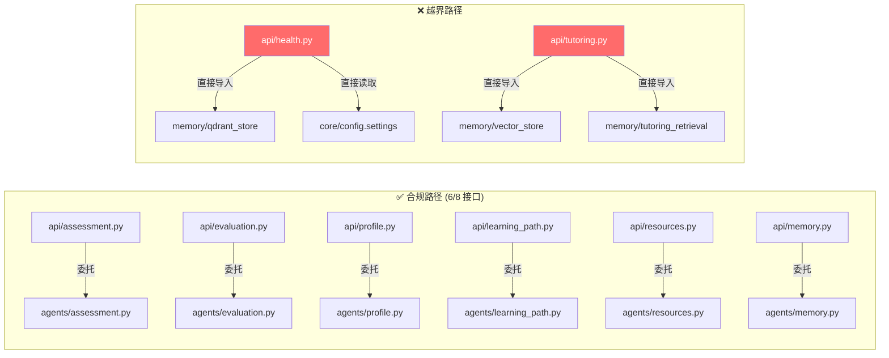
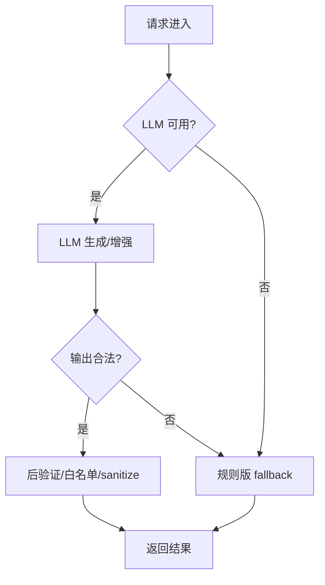

# Agent Service 实现状态评估报告

> **评估时间**: 2026-05-26
> **评估依据**: `AGENTS.md`、`Agent-Service.openapi.json` (v5.0.0)、`API_Agent内部接口规范.md`、`Agent-Service_开发导读.md`
> **当前状态**: 228 tests passed, 9/9 smoke PASS, OpenAPI 对齐测试 12 passed

---

## 一、总体评分

| 维度 | 评分 | 说明 |
|------|------|------|
| **架构分层合规** | ⭐⭐⭐⭐☆ | 6/8 个接口 API 层严格无业务逻辑；`tutoring` 和 `health` 存在越界 |
| **OpenAPI 契约对齐** | ⭐⭐⭐⭐⭐ | Schemas 层与 OpenAPI 字段级对齐，有自动化回归守卫 |
| **降级链完备性** | ⭐⭐⭐⭐⭐ | 全部 LLM 依赖接口均实现 LLM → 规则版 fallback |
| **错误处理与韧性** | ⭐⭐⭐⭐☆ | agents 层多层韧性优秀；API 层错误处理有缺口 |
| **测试覆盖** | ⭐⭐⭐⭐☆ | 228 测试全面覆盖 agents 层；API HTTP 层和错误路径测试不足 |
| **代码质量** | ⭐⭐⭐⭐☆ | 整体规范清晰；存在少量重复代码和死代码 |

**综合评价**: 项目在接口层面的实现质量处于 **良好到优秀** 之间。架构分层清晰，降级链设计成熟，测试覆盖率高。主要改进空间在 API 层分离度和错误处理一致性上。

---

## 二、逐接口评估

### 2.1 `GET /health` — 健康检查

| 检查项 | 状态 | 详情 |
|--------|------|------|
| 路由实现 | ✅ | `api/v1/health.py` |
| Schema 对齐 | ⚠️ **漂移** | `HealthData` 有 4 个字段不在 OpenAPI 规范中 |
| 业务逻辑分离 | ❌ **违规** | `build_health_data()` 约 45 行业务逻辑直接写在 API 层 |
| 降级链 | N/A | 确定性接口，无需 LLM |
| 测试 | ✅ | 4 个测试 |

> [!WARNING]
> **HealthData Schema 漂移**: Pydantic 模型含 `llm_configured`, `embedding_configured`, `reranker_configured`, `qdrant_collection` 四个 OpenAPI 中不存在的字段。且 `test_openapi_alignment.py` **未检测此漂移**（仅检查了 `{code, message, data}` 外层包装）。
>
> **API 层越界**: `build_health_data()` 直接导入 `memory.qdrant_store`、读取 `settings`、探测 Qdrant，属于业务逻辑，应下沉到 `agents/` 层。

---

### 2.2 `POST /tutoring/chat` — 智能辅导对话 (SSE)

| 检查项 | 状态 | 详情 |
|--------|------|------|
| 路由实现 | ✅ | `api/v1/tutoring.py`，SSE 流式响应 |
| Schema 对齐 | ✅ | `TutoringChatRequest`、SSE 事件类型均对齐 |
| 业务逻辑分离 | ❌ **违规** | ~80 行编排代码在 API 层 |
| 降级链 | ✅ | ReAct structured → JSON parse → `<agent_result>` tag → raw text → rule-based |
| SSE 协议 | ✅ | 事件类型 `chunk`/`knowledge_points`/`suggestion`/`done` 符合规范 |
| 测试 | ✅ | 35+ 测试（7 个测试文件覆盖） |

> [!WARNING]
> **API 层最严重的越界**: `api/v1/tutoring.py` 包含 `tutoring_event_stream()`、`_build_runtime_retrieval_context()`、`_build_model_response()`、`_build_shared_vector_store()`、`_build_runtime_events()` 等函数，直接导入 `memory.vector_store`、`memory.tutoring_retrieval`，违反 AGENTS.md 的「API 层应调用 agents 层完成业务处理」规则。

> [!NOTE]
> **降级链设计是全项目最成熟的**: 五级降级（ReAct → structured output → JSON parse → tag parse → rule-based），并且有独立测试覆盖每一级。

---

### 2.3 `POST /assessment/generate-questions` — 出题

| 检查项 | 状态 | 详情 |
|--------|------|------|
| 路由实现 | ✅ | `api/v1/assessment.py` |
| Schema 对齐 | ✅ | `QuestionGenerateRequest`、`GeneratedQuestion` 等字段级匹配 |
| 业务逻辑分离 | ⚠️ | 导入了 agents 层的 **私有函数** `_build_question_generation_knowledge_context` |
| 降级链 | ✅ | LLM (含 RAG) → 骨架占位题 |
| 测试 | ✅ | ~20 测试，含 RAG context 注入测试 |

> [!NOTE]
> **私有函数泄露**: `api/v1/assessment.py` 导入了 `_build_question_generation_knowledge_context`（以 `_` 前缀标记为私有），暴露了 agents 层实现细节。应将此调用封装在 agents 层的公开函数中。

---

### 2.4 `POST /assessment/evaluate` — 批改+诊断

| 检查项 | 状态 | 详情 |
|--------|------|------|
| 路由实现 | ✅ | `api/v1/assessment.py` |
| Schema 对齐 | ✅ | `AssessmentEvaluateRequest`、`AssessmentResult` 等匹配 |
| 业务逻辑分离 | ✅ | 正确委托到 `agents.assessment` |
| 降级链 | ✅ | 规则判分 → LLM 诊断 enrichment → fallback |
| 测试 | ✅ | 含 LLM enrichment 测试、sanitization 测试 |

✅ **此接口实现质量优秀，无显著问题。**

---

### 2.5 `POST /profile/generate` — 生成学习者画像

| 检查项 | 状态 | 详情 |
|--------|------|------|
| 路由实现 | ✅ | `api/v1/profile.py` |
| Schema 对齐 | ✅ | `ProfileGenerateRequest`、`ProfileData` 6 维度对齐 |
| 业务逻辑分离 | ✅ | 正确委托到 `agents.profile` |
| 降级链 | ✅ | LLM enrichment → 规则版（6 维度计算） |
| 测试 | ✅ | 11 测试，含不可变性验证 |

✅ **此接口实现质量优秀，无显著问题。**

> [!NOTE]
> **死代码**: `agents/profile.py` 中 `_extract_llm_reason()` (L107-114) 已被 `_coerce_guidance_level` 替代但未删除。

---

### 2.6 `POST /evaluation/generate` — 生成学习评价

| 检查项 | 状态 | 详情 |
|--------|------|------|
| 路由实现 | ✅ | `api/v1/evaluation.py` |
| Schema 对齐 | ✅ | `EvaluationGenerateRequest`、`EvaluationData` 3 表结构对齐 |
| 业务逻辑分离 | ✅ | 正确委托到 `agents.evaluation` |
| 降级链 | ✅ | LLM enrichment → 规则版（3 表 + summary） |
| 测试 | ✅ | 12 测试，含 full-table 验证和 fabricated row 拒绝 |

✅ **此接口实现质量优秀。** LLM 输出的行级白名单验证（拒绝捏造数据行）是全项目的最佳实践之一。

---

### 2.7 `POST /learning-path/generate` — 生成学习路径

| 检查项 | 状态 | 详情 |
|--------|------|------|
| 路由实现 | ✅ | `api/v1/learning_path.py` |
| Schema 对齐 | ✅ | `LearningPathGenerateRequest`、`LearningPathData` 匹配 |
| 业务逻辑分离 | ✅ | 正确委托到 `agents.learning_path` |
| 降级链 | ✅ | LLM（节点 ID 白名单约束）→ 规则版排序 |
| 测试 | ✅ | 12 测试 |

✅ **此接口实现质量优秀。** 节点 ID 白名单验证确保 LLM 不会发明不存在的知识节点。

> [!NOTE]
> `KnowledgeGraphEdge` 和 `LearningPathEdge` 使用 `alias="from"` 避免 Python 关键字冲突，但未设置 `model_config = ConfigDict(populate_by_name=True)`，可能导致 Python 内部构造时 `from_` 字段无法赋值。

---

### 2.8 `POST /resources/generate` — 生成学习资源 (异步)

| 检查项 | 状态 | 详情 |
|--------|------|------|
| 路由实现 | ✅ | `api/v1/resources.py`，202 + BackgroundTasks |
| Schema 对齐 | ✅ | `ResourceGenerateRequest`、`ResourceTaskResponse` 匹配 |
| 业务逻辑分离 | ✅ | 正确委托到 `agents.resources` |
| 异步模式 | ✅ | 202 Accepted + webhook callback，含指数退避重试 |
| 降级链 | ✅ | LLM 并行生成（含 RAG）→ 骨架 fallback → failed webhook |
| 测试 | ✅ | 22 测试，含 webhook 重试和 RAG context 测试 |

✅ **此接口实现质量优秀。** 三层降级（LLM → skeleton → failed webhook）和 webhook 重试机制设计完善。

---

### 2.9 `POST /memory/compress` — 会话记忆压缩

| 检查项 | 状态 | 详情 |
|--------|------|------|
| 路由实现 | ✅ | `api/v1/memory.py` |
| Schema 对齐 | ✅ | `MemoryCompressRequest`、`MemoryCompressResult`、`ExtractedFact` 匹配 |
| 业务逻辑分离 | ✅ | 正确委托到 `agents.memory` |
| 降级链 | ✅ | LLM fact 提取 → 规则版（3 种 fact 类型关键词匹配） |
| Qdrant 写入 | ✅ | Best-effort，写入失败不影响返回结果 |
| 测试 | ✅ | 16 测试，含持久化测试 |

✅ **此接口实现质量优秀。** 三层韧性设计（LLM 失败 → 规则版；embedding 失败 → 跳过持久化；Qdrant 写入失败 → 日志警告并正常返回）是最佳实践。

---

## 三、架构合规性评估

### 3.1 分层职责检查

| 层级 | AGENTS.md 要求 | 实际情况 | 合规 |
|------|---------------|----------|------|
| `api/` | 只处理路由、参数接收、返回包装、SSE、异步协议 | 6/8 个接口合规；`health` 和 `tutoring` 存在业务逻辑 | ⚠️ |
| `schemas/` | 只放 Pydantic 实体，严格对齐 OpenAPI | 全部对齐，无业务逻辑 | ✅ |
| `agents/` | 放 Agent/Workflow 编排逻辑 | 7 个 agent 模块，统一降级模式 | ✅ |
| `memory/` | 放 Qdrant 读写、检索 | 5 个模块，职责清晰 | ✅ |
| `tools/` | 放外部工具封装 | CLI 工具（ingestion, readiness, smoke） | ✅ |
| `prompts/` | 放系统提示词和模板 | 7 个 prompt 文件，按领域组织 | ✅ |
| `core/` | 放配置和基础设施初始化 | config, ai providers, readiness, logging | ✅ |

### 3.2 API 层越界详情

### 3.3 `get_ai_providers()` 泄露模式

**问题**: 6 个 API 端点文件重复执行 `get_ai_providers()` + `getattr(providers, "chat", None)` 模式，API 层不应了解 provider 内部结构。

**建议**: 将 provider 解析逻辑封装在 agents 层的公开函数签名中，API 层只传递 request 对象。

---

## 四、OpenAPI 契约对齐评估

### 4.1 Schema 对齐状态

| Schema | 对齐状态 | 详情 |
|--------|----------|------|
| `TutoringChatRequest` | ✅ | 含嵌套 `TutoringUserProfile`、`RecentMessage` |
| `ProfileGenerateRequest` / `ProfileData` | ✅ | 6 维度完整对齐 |
| `EvaluationGenerateRequest` / `EvaluationData` | ✅ | 3 表结构对齐 |
| `AssessmentEvaluateRequest` / `AssessmentResult` | ✅ | 含嵌套 `PerQuestionResult`、`Diagnosis` |
| `QuestionGenerateRequest` / `QuestionGenerateResult` | ✅ | 含 `GeneratedQuestion` |
| `LearningPathGenerateRequest` / `LearningPathData` | ✅ | 含 `LearningPathNode`、`LearningPathEdge` |
| `ResourceGenerateRequest` / `ResourceTaskResponse` | ✅ | |
| `MemoryCompressRequest` / `MemoryCompressResult` | ✅ | 含 `ExtractedFact` |
| `HealthData` | ❌ **漂移** | 4 个多余字段 |

### 4.2 OpenAPI 对齐测试覆盖

| 测试维度 | 覆盖 | 详情 |
|----------|------|------|
| 路径存在性 | ✅ | 8 个路径双向检查 |
| 响应包装结构 | ✅ | `{code, message, data}` |
| 请求 Schema 属性 | ⚠️ **部分** | 仅覆盖 `TutoringChatRequest`, `ProfileGenerateRequest`, `EvaluationGenerateRequest` |
| 响应 Schema 属性 | ⚠️ **部分** | 仅覆盖 `ProfileData`, `EvaluationData` |
| 嵌套 Schema | ⚠️ **部分** | 仅覆盖 `TutoringUserProfile`, `RecentMessage` |
| HTTP 方法匹配 | ✅ | |
| 状态码匹配 | ✅ | 200 vs 202 |
| `HealthData` 属性 | ❌ **缺失** | 未检测到漂移 |
| 字段类型验证 | ❌ **缺失** | 仅检查字段名，不检查类型 |

> [!IMPORTANT]
> **对齐测试覆盖缺口**: `AssessmentEvaluateRequest`, `AssessmentResult`, `QuestionGenerateRequest`, `QuestionGenerateResult`, `LearningPathGenerateRequest`, `LearningPathData`, `ResourceGenerateRequest`, `ResourceTaskResponse`, `MemoryCompressRequest`, `MemoryCompressResult`, `HealthData` 等 Schema 缺少属性级对齐断言。建议扩展 `test_openapi_alignment.py`。

---

## 五、降级链评估

所有 LLM 依赖接口均实现了完整的降级链，模式一致：

| 接口 | 降级层级 | 特殊防护 |
|------|----------|----------|
| assessment/generate-questions | 2 级 (LLM+RAG → 骨架题) | — |
| assessment/evaluate | 2 级 (规则判分 → LLM 诊断) | — |
| profile/generate | 2 级 (LLM enrichment → 规则版) | 字段级不可变验证 |
| evaluation/generate | 2 级 (LLM enrichment → 规则版) | 行级白名单，拒绝捏造行 |
| learning-path/generate | 2 级 (LLM → 规则排序) | 节点 ID 白名单 |
| resources/generate | 3 级 (LLM+RAG → 骨架 → failed webhook) | 并行生成 + 独立回退 |
| memory/compress | 3 级 (LLM → 规则版 → Qdrant best-effort) | 3 种 fact 类型 |
| tutoring/chat | **5 级** (ReAct → structured → JSON → tag → rule) | 最深降级链 |

✅ **降级链设计是本项目的核心亮点之一。**

---

## 六、测试体系评估

### 6.1 测试统计

| 维度 | 数量 | 说明 |
|------|------|------|
| 总测试数 | 228 | 全部通过 |
| agents 层测试 | ~117 | 覆盖全部 7 个 agent 模块 |
| API/Schema 层测试 | ~25 | OpenAPI 对齐 + health + SSE |
| memory 层测试 | ~19 | Qdrant 读写 + 检索 |
| tools 层测试 | ~17 | ingestion + readiness + smoke |
| E2E smoke | 9/9 PASS | 全部接口最小可用 |

### 6.2 测试优势

- ✅ **降级路径全覆盖**: 每个 agent 的 LLM 成功 + LLM 失败 + JSON 异常路径均有独立测试
- ✅ **Mock 隔离**: 全部使用 Fake Provider，无真实外部依赖
- ✅ **Output sanitization 测试**: LLM 捏造数据、越界值、未知枚举值的拒绝/修正
- ✅ **不可变性验证**: LLM enrichment 不会改变规则版结果的保证

### 6.3 测试缺口

| 缺口 | 严重度 | 说明 |
|------|--------|------|
| API HTTP 层端到端测试 | 🟡 中 | 缺少 `TestClient` 级别的请求→响应→状态码测试（仅 health 有） |
| 错误响应测试 | 🟡 中 | 无 400/422/500 错误路径的 API 层测试 |
| `HealthData` 漂移检测 | 🟡 中 | OpenAPI 对齐测试未覆盖 `HealthData` 属性 |
| 更多 Schema 属性对齐 | 🟡 中 | 约 11 个 Schema 缺少属性级对齐断言 |
| `conftest.py` 共享 fixtures | 🟢 低 | `FakeChatProvider` 在 6+ 测试文件中重复定义 |
| `prompts/` 层测试 | 🟢 低 | 仅 tutoring prompts 有测试 |
| 并发/负载测试 | 🟢 低 | 异步资源生成未测试并发场景 |

---

## 七、代码质量细项

### 7.1 🔴 需要修复

| # | 问题 | 文件 | 说明 |
|---|------|------|------|
| 1 | HealthData Schema 漂移 | `schemas/common.py` | 4 个多余字段，需同步 OpenAPI 或删除 |
| 2 | API 层业务逻辑 — health | `api/v1/health.py` | `build_health_data()` 应下沉到 agents 层 |
| 3 | API 层业务逻辑 — tutoring | `api/v1/tutoring.py` | ~80 行编排代码应下沉到 agents 层 |
| 4 | `model_name` 可空性不匹配 | `schemas/common.py` + `api/v1/health.py` | `HealthData.model_name: str` 但实际可返回 `None` |

### 7.2 🟡 建议改进

| # | 问题 | 文件 | 说明 |
|---|------|------|------|
| 5 | 私有函数跨层导入 | `api/v1/assessment.py` | 导入 `_build_question_generation_knowledge_context` |
| 6 | `get_ai_providers()` 模式泄露 | 6 个 API 端点文件 | provider 解析应封装在 agents 层 |
| 7 | API 层无 try/except | assessment, evaluation, profile, learning_path, memory, resources | agents 层异常会变成未处理的 500 |
| 8 | `_truncate_chunk` 重复 3 份 | assessment.py, resources.py, tutoring_tools.py | 应提取到共享工具函数 |
| 9 | `_build_chunk_content` 无 `.get()` 保护 | `agents/tutoring.py` L211 | 硬编码 `L1/L2/L3` 字典查找，可能 `KeyError` |
| 10 | `alias="from"` 缺少 `ConfigDict` | `schemas/learning_path.py` | `from_` 字段可能无法正常赋值 |

### 7.3 🟢 低优先级

| # | 问题 | 文件 | 说明 |
|---|------|------|------|
| 11 | 死代码 `_extract_llm_reason()` | `agents/profile.py` L107-114 | 未被调用 |
| 12 | `import re as _re` 重复导入 | `agents/memory.py` L211 | 模块级已有 `import re` |
| 13 | `logger` 声明在文件底部 | assessment, evaluation, learning_path, profile | 应移到模块顶部 |
| 14 | `FakeChatProvider` 重复定义 | 6+ 测试文件 | 应提取到 `conftest.py` |
| 15 | `_coerce_options` 返回类型松散 | `agents/assessment.py` L436 | 返回 `list[dict]` 而非 `list[QuestionOption]` |
| 16 | `fallback_*` 函数未使用参数 `_row` | `agents/evaluation.py` L338-360 | 签名约定参数，实际不使用 |
| 17 | `HealthResponse` 未导出 | `schemas/__init__.py` | 定义在 `common.py` 但未被 re-export |
| 18 | CORS 通配符 | `main.py` | `allow_origins=["*"]` 生产环境需限制 |
| 19 | `ensure_collection_exists` 静默吞异常 | `memory/qdrant_store.py` | 生产环境可能掩盖真实问题 |
| 20 | 提示词与解析不一致 | `prompts/*.py` | 提示词要求「不加 markdown 代码块」，但 agents 层仍解析 markdown fences（防御性编码，可接受） |

---

## 八、与 OpenAPI v5.0.0 的关键差异总结

> [!IMPORTANT]
> 以下差异需要确认是代码侧修正还是 OpenAPI 侧更新：

| 差异点 | OpenAPI 规范 | 当前代码 | 建议 |
|--------|-------------|----------|------|
| `HealthData` 字段数 | 5 字段 | 9 字段（多 4 个） | 同步 OpenAPI 或删除多余字段 |
| `HealthData.model_name` | `string` (required) | 可为 `None` | 改为 `Optional[str]` 并同步 OpenAPI |
| `TutoringUserProfile.modal_preference` | `object` | `ModalPreference \| dict \| None` | 收窄为 `ModalPreference \| None` |
| `AssessmentQuestion.options` | `array of objects` | `list[dict[str, Any]]` | 考虑使用 `list[QuestionOption]` |
| `QuestionGenerateRequest.personalization_context` | 有子属性定义 | `dict[str, Any] \| None` | 考虑结构化类型 |

---

## 九、优先改进建议

### 短期（下 1-2 个迭代）

1. **修复 HealthData 漂移**: 决定是扩展 OpenAPI 还是移除多余字段，并补充对齐测试
2. **tutoring API 层下沉**: 将 `_build_runtime_retrieval_context`、`_build_model_response` 等编排函数迁移到 `agents/tutoring.py`
3. **health API 层下沉**: 创建 `agents/health.py`，将 `build_health_data()` 迁移过去
4. **补充 API 层错误处理**: 为 6 个缺少 try/except 的端点添加统一异常捕获

### 中期（下 3-5 个迭代）

5. **扩展 OpenAPI 对齐测试**: 覆盖全部 Schema 的属性级断言
6. **提取共享工具**: `_truncate_chunk` 提取到公共模块
7. **封装 provider 解析**: 将 `get_ai_providers()` 调用从 API 层移除，封装进 agents 层函数签名
8. **添加 API HTTP 层测试**: 使用 `TestClient` 测试请求→响应完整路径

### 远期

9. **结构化更多松散类型**: `dict[str, Any]` 字段逐步替换为 Pydantic 模型
10. **生产化 CORS**: 移除通配符，配置允许来源列表
11. **`FakeChatProvider` 共享**: 提取到 `conftest.py` 减少测试代码重复

---

## 十、结论

本项目接口实现整体质量 **良好**，核心架构设计成熟，在以下方面表现出色：

- ✅ **Schema 与 OpenAPI 的严格对齐**（有自动化回归守卫）
- ✅ **统一且完整的降级链设计**（全部 LLM 接口均有 fallback）
- ✅ **多层韧性的错误处理**（agents 层每个 LLM 调用均 try/except）
- ✅ **高测试覆盖率**（228 测试 + 9/9 smoke）
- ✅ **清晰的代码组织**（7 个 agent 模块对应 8 个接口）

主要改进方向集中在：

- ❌ `health` 和 `tutoring` 的 API 层业务逻辑需要下沉
- ⚠️ OpenAPI 对齐测试需要扩展覆盖范围
- ⚠️ API 层需要统一的错误处理模式
- ⚠️ `HealthData` Schema 漂移需要同步修复
