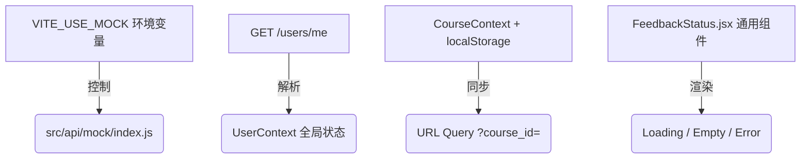

# 阶段一：前端对齐现有接口联调实施方案

本方案汇总了通过 `/grill-me` 互动问答确立的前端接口对齐与联调改造方案。所有设计均在不改动 Client API、Agent API 和 SQL Schema 的前提下，使前端在真实网络环境下可用。

---

## 📌 核心设计决议汇总

### 1. Mock 开关控制
* **改造方式：** 不修改 `main.jsx` 的同步导入流程，在 `src/api/mock/index.js` 中读取 `import.meta.env.VITE_USE_MOCK` 环境变量。
* **逻辑：** 仅当该变量为 `'true'` 时，才实例化 `MockAdapter` 并注册 Mocks，否则静默跳过拦截，使 API 直接连向真实后端。

### 2. 登录态与角色路由保护 (Auth Guard)
* **角色获取来源：** 用户登录后或应用加载时，如果 `localStorage` 中存在 Token，则向后端发起 `GET /users/me` 请求。
* **状态管理：** 获取到的 `UserInfo`（包含 `role`）存入全局 `AuthContext` 状态中。
* **路由保护：** 封装 `ProtectedRoute` 拦截组件，拦截并校验未登录或角色不符的访问。若接口报 `401 Unauthorized`，自动清除本地 Token 并重定向至登录页 `/`。

### 3. 课程上下文管理 (Course Context)
* **逻辑：** 封装 `CourseContext` 统一管理课程列表及 `activeCourseId`。
* **数据恢复与更新：**
  * 页面加载时从 `localStorage` 读取上一次选择的课程 ID，并与 `/courses` 接口返回的最新列表比对，确保权限有效。
  * 页面 URL 优先携带并识别 `?course_id=xxx` 参数，并同步至 Context。
  * 在 `TopNavBar` 中渲染课程切换下拉菜单，切换后更新 URL 并触发关联页面（如 Dashboard、LearningPath）重新加载。

### 4. API Service 与页面重构
对齐后端正式的 `Client-API.openapi.json` 端点与字段结构：
* **智能辅导：** 重构 `chat.js` 和 `AIChat.jsx`，API 改为 `/tutoring/*`。发送消息采用 Fetch 原生消费 SSE `text/event-stream` 流式内容。
* **学习路径与效果：** 接口路径修正为 `/profile?course_id=...` 与 `/evaluation?course_id=...`。
* **轮询状态：** 修正为 `GET /tasks/{task_id}`，移除错误的 `/status` 后缀。
* **图表回退策略：**
  * **画像雷达图：** 对齐后端五维度 `modal_preference`。
  * **历史柱状图与圆环图：** 由于后端无法完全提供相关历史数据，相关元素将隐藏或简化为简易的统计卡片。

### 5. 基础状态反馈组件 (`FeedbackStatus.jsx`)
* **实现：** 抽取独立的 `FeedbackStatus` 通用渲染组件。
* **功能：**
  * 支持接收 `loading` / `empty` / `error` 状态类型。
  * 支持自定义标题、提示文本以及交互行为（如：错误时的“重新加载”/“重试”按钮回调）。

### 6. ESLint 修复与 Playwright E2E 测试
* **ESLint 错误清零：** 修复作用域前调用（hoisting）、无效变量分配等 36 个编译警告与错误。
* **Playwright E2E 测试用例：** 在 `frontend/e2e/` 下编写 3 条核心端到端用例：
  1. 学生登录 -> 进入课程资源库。
  2. 学生切换课程 -> 访问学习路径规划与在线测试。
  3. 教师登录 -> 切换选择课程 -> 查看学生名册及学情概览。
