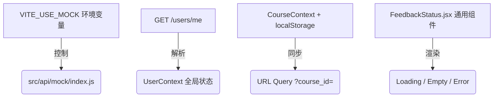

# 阶段一：前端对齐现有接口联调实施方案

本方案汇总了前端接口对齐与联调改造方案。所有设计均在不改动 Client API、Agent API 和 SQL Schema 的前提下，使前端在真实网络环境下可用。

---

## 📌 核心设计决议汇总

### 1. Mock 开关控制
* **改造方式：** 不修改 `main.jsx` 的同步导入流程，在 `src/api/mock/index.js` 中读取 `import.meta.env.VITE_USE_MOCK` 环境变量。
* **逻辑：** 仅当该变量为 `'true'` 时，才实例化 `MockAdapter` 并注册 Mocks，否则静默跳过拦截，使 API 直接连向真实后端。

### 2. 认证与登录注册主链修复 (Auth Guard)
对齐后端真实认证接口，修补 Mock 的不完整状态：
* **登录输入框从“用户名”改为“邮箱”：** 将 `Login.jsx` 的 UI 登录输入框标签从“用户名”或“账号”明确改为“邮箱”，并将对应的组件状态变量/属性（如 `username`）重命名为 `email`。因为正式登录契约只接受 `email` 字段，若保留 `username` 容易继续误导用户。
* **算术验证码获取与提交：** 登录与注册页面接入 `GET /auth/captcha` 获取算术验证码，前端组件解析并渲染算术题（对应字段为 `captcha_question`）；表单提交时，必须附带验证码凭证 `captcha_token` 及用户输入的算术答案 `captcha_code`。
* **登录凭证持久化：** 登录成功后，将后端返回的 `response.data.token` 写入本地 `localStorage.setItem('access_token', token)`（不使用原 `access_token` / `refresh_token` 双 Token 形式）。
* **角色重定向保护：** 页面加载或登录后调用 `GET /users/me` 将获取到的 `UserInfo`（包含真实 `role`）存入全局 `AuthContext`。**移除根据用户名或硬编码判定的逻辑**（如 `username === 'teacher'`），严格根据 `response.data.user.role` 或全局上下文角色重定向到 `/teacher`、`/dashboard` 或 `/admin`。
* **注册状态兼容：** 注册请求 `POST /auth/register` 的响应处理需兼容后端的 `201 Created` 状态。
* **路由拦截：** `ProtectedRoute` 拦截未登录或角色不符的访问。若接口返回 `401 Unauthorized`，自动清除本地 Token 并重定向至登录页 `/`。

### 3. 课程与深链上下文管理 (Course & Deep Link Context)
* **逻辑：** 封装 `CourseContext` 统一管理课程列表及 `activeCourseId`。
* **数据恢复与更新：**
  * 页面加载时从 `localStorage` 读取上一次选择的课程 ID，并与 `/courses` 接口返回的最新列表比对，确保权限有效。
  * **清除全局硬编码：** 彻底移除所有 `default_course` 硬编码。
  * **支持 URL 深链与限制：** 
    * 核心业务页面路由（如 Dashboard、LearningPath、Quiz、TeacherStudentReport 等）均优先识别 URL 中的查询参数（如 `?course_id=...&student_id=...`），并将该参数同步更新到全局 Context 中。
    * **屏蔽资源详情深链：** 鉴于现有 Client API 没有资源详情查询端点，且资源列表接口不返回 `content` 字段，**阶段一内不支持 `resource_id` 的深链跳转，并全面隐藏资源详情页的入口**（或仅在 Dashboard 列表中展示基础字段，不允许点击跳转进入 `ResourceDetail` 详情页）。

### 4. API Service 对齐清单
对齐后端正式的 `Client-API.openapi.json` 端点与字段结构：
* **智能辅导：** 重构 `chat.js` 和 `AIChat.jsx`，API 改为 `/tutoring/*`。发送消息采用 Fetch 原生消费 SSE `text/event-stream` 流式内容。
* **学习路径与效果：** 接口路径修正为 `/profile?course_id=...` 与 `/evaluation?course_id=...`。
* **教学班级监控：** 
  * 重构旧路径 `/api/v1/teacher/classes` -> `/courses` (获取课程/班级列表)；
  * `/api/v1/course/{courseId}/students` -> `/teaching/classes/{class_id}/students` (学生名单，对齐 `StudentBrief` 契约结构)；
  * `/api/v1/teacher/students/{studentId}/report` 分拆为：
    * `/teaching/classes/{class_id}/students/{student_id}` (获取基础画像)；
    * `/teaching/classes/{class_id}/students/{student_id}/learning` (获取学习效果与测试报告)；
    前端页面在加载报告时，通过 `Promise.all` 聚合上述两个接口的数据。
* **管理员控制台：**
  * 重构日志路径：`/admin/logs/agents` -> `/admin/logs/agent` (单数)；
  * `/admin/logs/system` -> `/admin/logs/operations`。
* **轮询状态：** 修正为 `GET /tasks/{task_id}`，移除错误的 `/status` 后缀。

### 5. 按正式字段重构页面与 Mock 屏蔽
* **资源类型语义重构：** 资源分类按契约中定义的 `document` / `mindmap` / `reading` / `code` / `video` 重新定义，并修正相关过滤器的分类名及路由映射。
* **教师监控与警告屏蔽：** 
  * 隐藏 `TeacherConsole.jsx` 里的 AI 洞察模块（平均活跃时间、覆盖率）。
  * 由于学生列表接口不返回任何掌握度数据，列表表格中**仅展示 `StudentBrief` 声明的账号基础字段，隐藏掌握度进度条**。
* **无接口按钮禁用：** 对类似“发送反馈”、“导出报告”等暂无后端接口支撑的按钮，进行**禁用 (disabled) 或隐藏**处理。

### 6. 基础状态反馈组件 (`FeedbackStatus.jsx`)
* **实现：** 抽取独立的 `FeedbackStatus` 通用渲染组件。
* **功能：**
  * 支持接收 `loading` / `empty` / `error` 状态类型。
  * 支持自定义标题、提示文本以及交互行为（如：错误时的“重新加载”/“重试”按钮回调）。

### 7. Playwright E2E 测试环境与数据约束配置
* **运行环境：** Playwright 的端到端测试用例必须配置运行在 **真实的 Backend 联调环境** 下（关闭 Mock 模式）。
* **测试数据约束 (E2E 稳定保障)：** 使用数据库预置的真实测试账号和课程。为了防止空数据导致页面断言不稳定，数据库必须满足以下具体的数据约束：
  * **学生多课程绑定：** 学生账号至少加入两门课程，才能测试课程切换。
  * **教师课程包含学生：** 教师课程必须包含学生。
  * **学情数据完整：** 目标学生应预置画像（UserProfile）、评估（Evaluation）或学习路径（LearningPath）快照，才能稳定测试学情概览。
  * 预置的测试课程中必须预先填充资源列表、学习路径节点以及 Quiz 题目。
* **用例覆盖：**
  1. 学生真实登录 -> 自动进入课程资源库列表。
  2. 学生切换课程 -> 访问学习路径规划与在线测试。
  3. 教师登录 -> 切换选择课程 -> 查看学生名册及学情概览。

---

## 🏁 阶段一验收与收口条件
在宣布阶段一完成前，项目必须通过以下两个指标的自动化验收：
1. **ESLint 静态检查通过：** 执行 `npm run lint` 必须输出为 **0 errors, 0 warnings**。现有 36 个编译错误和 1 个警告必须全部清零收口。
2. **E2E 冒烟测试通过：** 执行 Playwright E2E 测试，上述 3 条核心业务主链用例必须全部为 Green。
