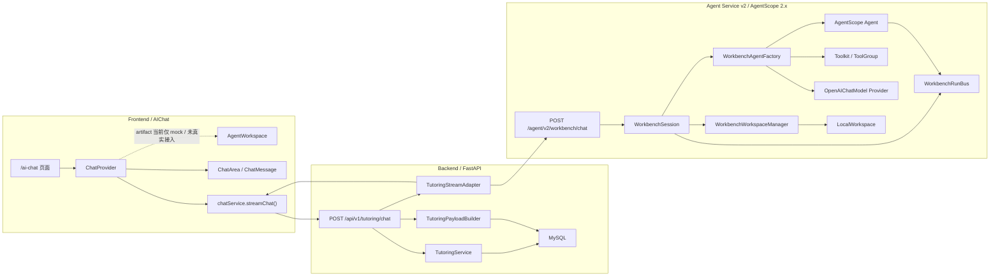
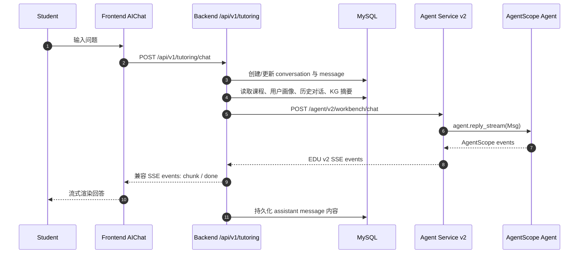
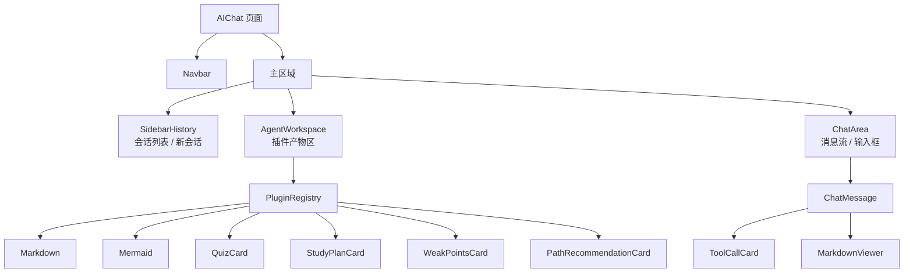
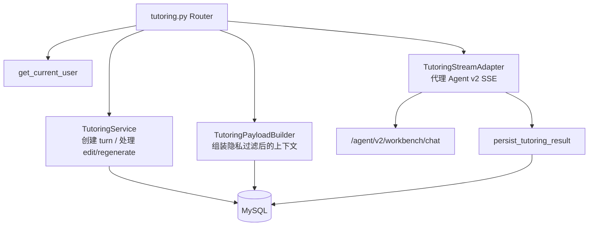
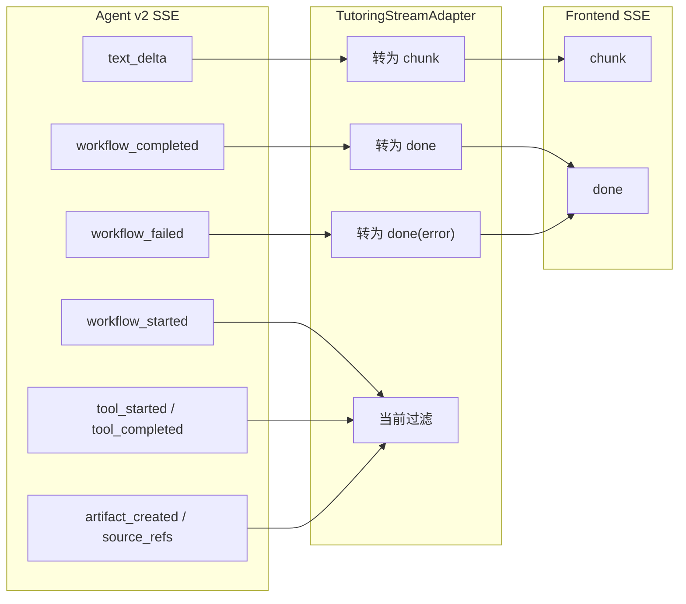
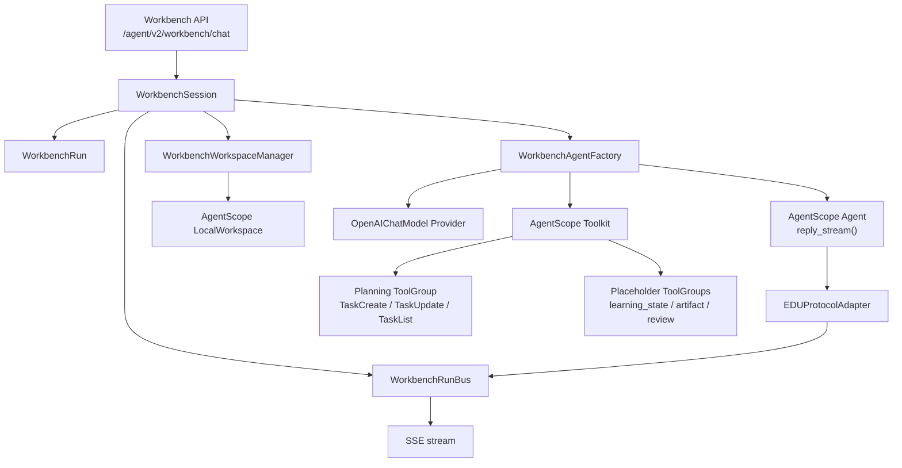

# AIChat v2 当前状态存档

日期：2026-07-01

## 结论

当前 AIChat 已经完成“主聊天链路接入 Agent v2”，但还没有完成“工作台能力原生适配”。

- 前端仍通过 Backend 的 `/api/v1/tutoring/chat` 发起聊天，不直连 Agent Service，符合项目边界。
- Backend 内部已经从旧 `/agent/v1/tutoring/chat` 切到新 `/agent/v2/workbench/chat`。
- Agent v2 使用 AgentScope 2.x `Agent.reply_stream()`、`Toolkit`、`ToolGroup`、`LocalWorkspace`、`ReActConfig` 等框架能力。
- Backend 目前把 v2 的 `text_delta/workflow_completed/workflow_failed` 转换回前端旧事件 `chunk/done`，因此前端能显示文本流。
- v2 的 `tool_started/tool_completed/artifact_created/source_refs` 当前被 Backend 过滤，前端 `AgentWorkspace` 还没有接入真实工具产物。

## 总体架构图



## 请求时序图



## 前端当前样式

### 页面结构

`/ai-chat` 当前由四块组成：

- `Navbar`：顶部导航。
- `SidebarHistory`：左侧历史会话。
- `AgentWorkspace`：中间工作区，已有插件渲染能力，但真实 v2 artifact 尚未接入。
- `ChatArea` / `ChatMessage`：右侧对话区，负责流式文本、知识点、图表、工具状态卡片展示。



### 前端事件消费现状

前端 `chatService.streamChat()` 只对以下事件有明确分支：

| 前端事件 | 当前处理 |
| --- | --- |
| `chunk` | 追加到 assistant message content |
| `done` | 停止 loading，绑定 message_id / conversation_id |
| `diagram` | 追加到 message.diagrams |
| `knowledge_points` | 追加知识点标签 |
| `review` | 标记回答可能不准确 |
| `status` | 更新 `ToolCallCard` 状态 |

因此前端目前依赖 Backend 做 v2 到旧协议的兼容转换。

## Backend 当前样式

Backend 仍是前端与 Agent Service 的唯一边界。核心文件：

- `backend/app/api/v1/tutoring.py`
- `backend/app/services/tutoring_service.py`
- `backend/app/services/tutoring_payload_builder.py`
- `backend/app/services/tutoring_stream_adapter.py`



### Backend 的协议转换

当前 Backend 做了两层职责：

1. 将 Backend payload 包装成 v2 Workbench payload。
2. 将 v2 Agent 事件转换成前端兼容事件。



## Agent v2 当前样式

Agent v2 当前是独立服务，默认由 `start_all.sh` 在 8002 端口启动。核心结构：

- `api/workbench.py`：`POST /agent/v2/workbench/chat` SSE 入口。
- `session/workbench_session.py`：创建 run，启动后台 AgentScope `reply_stream()`。
- `session/run_bus.py`：内存事件总线，支持 SSE subscriber 消费。
- `runtime/protocol_adapter.py`：AgentScope event 到 EDU v2 event 的映射。
- `agents/workbench_factory.py`：创建 AgentScope `Agent`。
- `agents/model_provider.py`：读取 `LLM_PROVIDER=agentscope_openai` 等配置，创建 `OpenAIChatModel`。
- `workspaces/workbench_workspace_manager.py`：按用户/课程/会话隔离 `LocalWorkspace`。
- `tools/workbench_toolkit.py`：注册 Plan、占位学习状态、Artifact、Review 等 ToolGroup。



### AgentScope 框架使用状态

| 能力 | 当前状态 | 说明 |
| --- | --- | --- |
| `Agent.reply_stream()` | 已使用 | 主运行路径消费 AgentScope event stream |
| `Toolkit` / `ToolGroup` | 已使用 | Plan 工具为真实 AgentScope task tool；业务工具仍有占位 |
| `ReActConfig` | 已使用 | `max_iters=8` |
| `ContextConfig` | 已使用 | 控制 tool result limit |
| `LocalWorkspace` | 已使用 | 已做 workspace root escape 防护 |
| 模型 provider | 已接入 | 配置齐全时创建 AgentScope `OpenAIChatModel` |
| Memory / RAG middleware | 未完成 | 依赖 AgentScope 能力，但当前未接入真实链路 |
| Agent Service 官方 `create_app` | 未采用 | 当前采用 EDU FastAPI facade + AgentScope 内核方案 |

## 当前缺口

1. **前端没有原生消费 v2 事件**
   当前仍依赖 Backend 转旧协议。工具事件、source refs、artifact 没有进入前端状态。

2. **AgentWorkspace 没有真实产物输入**
   `AgentWorkspace` 和 `PluginRegistry` 已存在，但真实 `artifact_created` 未透传到 `workspaceArtifacts`。

3. **工具调用 UI 不是 AgentScope 原生事件驱动**
   `ToolCallCard` 已存在，但当前主要依赖旧 `status` 事件或 mock demo。

4. **RAG / Memory 尚未接入框架中间件**
   当前设计要求优先使用 AgentScope / mem0 / RAG 相关能力，但实现仍是占位。

5. **Backend 兼容层需要升级成 v2 协议 adapter**
   不能长期只保留 `chunk/done`，应定义稳定的 Client API 事件集。

## 建议下一阶段

### 阶段 1：定义 Client AI Workbench 事件契约

保留 `chunk/done` 兼容，同时新增：

| 建议事件 | 用途 |
| --- | --- |
| `tool_call` | 驱动 `ToolCallCard` |
| `artifact` | 写入 `workspaceArtifacts` |
| `source_refs` | 展示 RAG 引用 |
| `agent_status` | 展示模型调用、检索、工具执行状态 |

### 阶段 2：Backend 透传并转换 v2 工作台事件

`TutoringStreamAdapter` 不再过滤工具和 artifact 事件，而是转换成 Client API 稳定事件。

### 阶段 3：前端 ChatContext 原生消费工作台事件

新增事件处理：

- `tool_call` -> `message.toolCalls`
- `artifact` -> `workspaceArtifacts`
- `source_refs` -> assistant message references
- `agent_status` -> loading/status UI

### 阶段 4：Agent v2 工具返回真实结构化产物

让 AgentScope tools 返回可渲染的 `Artifact` payload，例如：

```json
{
  "type": "Markdown",
  "props": {
    "content": "..."
  }
}
```

### 阶段 5：补齐 RAG / Memory

按 AgentScope 2.x 框架能力接入 RAG 和长期记忆，避免手写伪框架链路。

## 当前可验收范围

当前可以验收：

- 用户在 `/ai-chat` 发消息。
- Frontend 请求 Backend `/api/v1/tutoring/chat`。
- Backend 转发到 Agent v2 `/agent/v2/workbench/chat`。
- Agent v2 通过 AgentScope `reply_stream()` 产出文本。
- Backend 将 `text_delta` 转为 `chunk`。
- Frontend 流式显示回答并在 `done` 后停止 loading。

当前不应宣称完成：

- 完整 AI 工作台 artifact 流。
- Agent 工具调用状态实时展示。
- RAG source refs 展示。
- 长期记忆 / mem0 完整接入。
- 前端原生 v2 事件协议。
