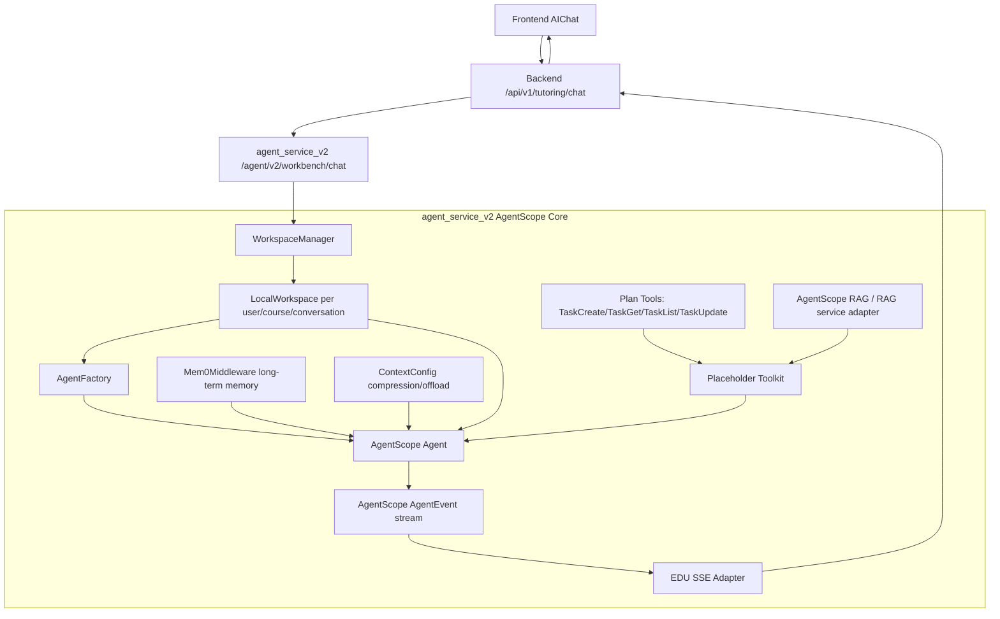
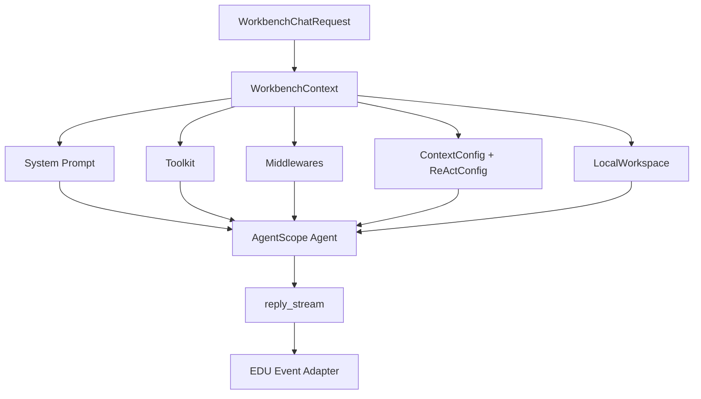
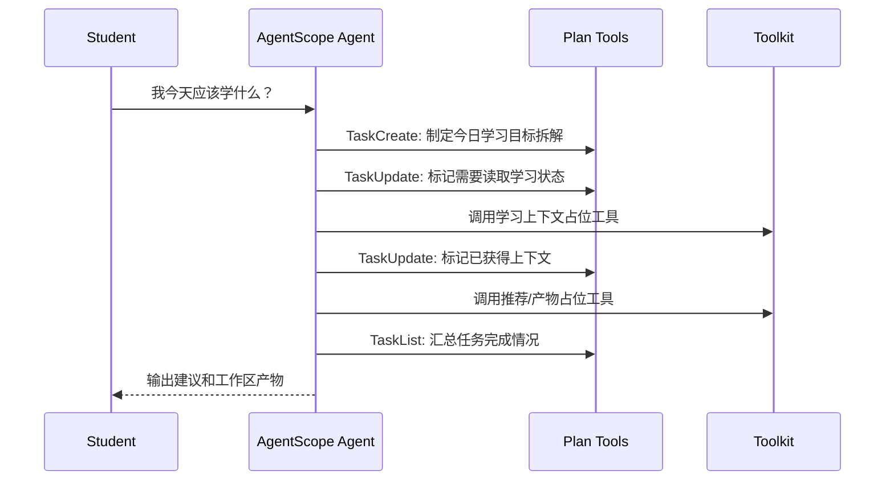
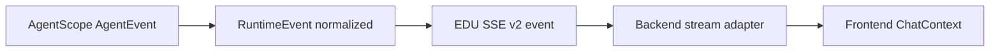

# AIChat AgentScope-native Workbench v2 Design

> 日期：2026-06-30  
> 状态：待审核  
> 范围：以 AIChat / AI 工作台为下一阶段主线，基于 `agent_service_v2` 和 AgentScope 2.0.3 全量实现新智能体链路。  
> 核心决策：旧 `agent_service/` 保留但不参与 AIChat v2 主链路；新实现必须以 AgentScope Workspace、Agent、Plan、Memory、RAG、Context 和 Toolkit 为架构核心。

## 1. 设计修正

上一版设计把 AgentScope 放在自定义 runtime 之后，实际会演变成“EDU 自己写工作流，AgentScope 只负责模型调用”。该方向废弃。

本版设计改为 AgentScope-native：

- Workspace 先行，用 `user_id + course_id + conversation_id` 划定每个 AIChat 的工作边界。
- AgentScope `Agent` 是核心推理与行动引擎，使用 `reply_stream()` 的事件流作为运行时事实。
- Plan 使用 AgentScope 内置计划工具 `TaskCreate / TaskGet / TaskList / TaskUpdate`，由 LLM 维护学习任务与执行计划。
- 长期记忆优先接 AgentScope `Mem0Middleware`，而不是先复刻旧 memory 逻辑。
- RAG 优先采用 AgentScope RAG / RAG service 形态，旧 Qdrant 检索链路只作为数据迁移或后续适配参考。
- 上下文管理优先使用 AgentScope `ContextConfig` 和 workspace offload。
- Toolkit 只先定义占位工具边界，不在第一阶段搬运旧智能体业务实现。
- EDU SSE 只是 AgentScope event adapter，不能反过来主导 runtime 设计。

## 2. 官方能力依据

本设计以 AgentScope 2.0.3 文档与本地包 introspection 为准：

- Agent：`https://docs.agentscope.io/versions/2.0.3/zh/building-blocks/agent`
- Plan：`https://docs.agentscope.io/versions/2.0.3/zh/building-blocks/plan`
- RAG：`https://docs.agentscope.io/versions/2.0.3/zh/deploy/rag`
- 本地版本：`agentscope==2.0.3`
- 本地已确认可用对象：`Agent`、`ContextConfig`、`ReActConfig`、`Toolkit`、`TaskCreate`、`TaskGet`、`TaskList`、`TaskUpdate`、`LocalWorkspace`、`Mem0Middleware`

## 3. 总体架构



## 4. Workspace 边界

Workspace 是 AIChat v2 的第一层隔离，而不是可选能力。

```text
workspace_id = ai-chat/{user_id}/{course_id or global}/{conversation_id}
workdir      = agent_service_v2/workspaces/{safe_workspace_id}
```

职责：

- 隔离不同用户、课程和会话的 AIChat 工作区。
- 承载 AgentScope offload 的上下文、工具结果和中间文件。
- 避免学生端不同 AIChat 会话混合上下文。
- 为后续 artifact 文件、RAG 上传临时文件、生成内容草稿留出边界。

实现原则：

- 首期使用 `LocalWorkspace`。
- workspace 路径必须由服务端生成，不能直接信任前端传入路径。
- workspace 不直接作为业务持久化来源；业务持久化仍由 Backend 管理。

## 5. Agent 设计



Agent 配置：

- `name`: `edu_ai_chat_workbench`
- `system_prompt`: 定义学生学习工作台身份、边界、工具使用约束、必须先规划再回答。
- `toolkit`: Plan tools + RAG placeholder + AIChat placeholder tools。
- `middlewares`: `Mem0Middleware` 优先，后续可加 tracing / budget / RAG middleware。
- `context_config`: 负责上下文压缩、工具结果长度控制。
- `react_config`: 限制 max iters，避免无限工具循环。
- `offloader`: 绑定 workspace，允许框架管理大上下文和中间结果。

## 6. Plan 设计

AIChat 的 LLM 必须被授予计划能力。计划不由前端按钮硬编码，也不由 Backend 预设 workflow。

Plan 工具：

- `TaskCreate`
- `TaskGet`
- `TaskList`
- `TaskUpdate`

预期行为：



Plan 在第一阶段的验收不是业务推荐质量，而是 Agent 能通过框架计划工具产生可观测计划步骤。

## 7. 长期记忆与上下文

长期记忆优先采用 AgentScope `Mem0Middleware`。

设计：

- `user_id` 传给 `Mem0Middleware(user_id=...)`。
- 模式优先使用 `both`，让 Agent 既能被动获得相关记忆，也能主动 `search_memory / add_memory`。
- `Mem0Middleware.list_tools()` 返回的 memory tools 注入 `Toolkit`。
- 若本地缺少 mem0 外部服务或模型配置，第一阶段降级为“middleware disabled but boundary preserved”，不回退到旧 `agent_service` memory。

上下文管理：

- 使用 `ContextConfig(trigger_ratio, reserve_ratio, tool_result_limit)`。
- 大型工具结果、长文档和多模态内容交给 workspace offload。
- Backend 传入的学习上下文只作为本轮输入，不替代长期记忆。

## 8. RAG 设计

RAG 优先走 AgentScope RAG / RAG service 形态。

第一阶段只建立适配边界：

- `RagServiceAdapter`: 负责连接 AgentScope RAG service 或本地 RAG 组件。
- `retrieve_course_context`: Toolkit 中的占位工具，输入 query、course_id、workspace_id，输出标准 observation。
- 旧 Qdrant 数据不直接复用旧检索代码；后续通过 RAG service 配置、数据迁移或 connector 适配。

RAG 事件要求：

- 检索开始：映射为 `tool_started`。
- 检索结果：映射为 `tool_completed` 和 `source_refs`。
- 检索失败：映射为 `tool_failed`，Agent 可继续基于已有上下文回答但必须暴露依据不足。

## 9. Toolkit 占位

第一阶段 Toolkit 不实现完整业务，只划定工具槽位：

| 工具 | 当前状态 | 作用 |
|---|---|---|
| Plan tools | 必须接入 | 让 Agent 自主规划 |
| Memory tools | 优先接入 | 长期记忆搜索与写入 |
| `retrieve_course_context` | 占位 | 课程 RAG 检索 |
| `read_learning_state` | 占位 | 读取 Backend 传入的画像、路径、评估摘要 |
| `draft_study_artifact` | 占位 | 生成工作区 artifact 草稿 |
| `review_grounding` | 占位 | 审查来源和防幻觉 |

占位工具必须返回结构化 observation，不返回 UI 文案。

## 10. 事件适配



EDU SSE 事件保持产品稳定，但来源必须是 AgentScope 事件或框架工具生命周期：

| EDU 事件 | 来源 |
|---|---|
| `workflow_started` | AgentScope reply start |
| `tool_started` | AgentScope tool call start |
| `tool_completed` | AgentScope tool result end |
| `tool_failed` | AgentScope tool error / adapter error |
| `source_refs` | RAG tool observation |
| `artifact_created` | artifact placeholder tool observation |
| `critic_completed` | review placeholder tool observation |
| `text_delta` | AgentScope text delta |
| `workflow_completed` | AgentScope reply end |
| `workflow_failed` | max iters / exception / rejected tool |

## 11. Backend 与 Frontend 边界

Backend：

- 仍提供 `/api/v1/tutoring/chat` 给前端。
- 内部调用 `/agent/v2/workbench/chat`。
- 负责会话、消息和后续 artifact 持久化。
- 不把旧 `/agent/v1/tutoring/chat` 作为 AIChat v2 fallback。

Frontend：

- 不直连 Agent Service。
- `ChatContext` 消费 EDU SSE v2。
- 右侧显示 text stream 与 tool trace。
- 中间 Workspace 渲染 `artifact_created`。

## 12. 验收标准

- `agent_service_v2` 启动时可以创建 per-chat `LocalWorkspace`。
- AIChat 请求能创建 AgentScope `Agent`，且 Agent 绑定 workspace、Plan tools、ContextConfig、ReActConfig。
- Plan tools 进入 Toolkit，并能在事件流中观察到计划相关工具调用。
- Mem0Middleware 边界明确；配置可用时接入，配置不可用时显式 disabled。
- RAG 使用 AgentScope RAG service adapter 边界，不调用旧智能体检索实现。
- Toolkit 业务工具处于占位状态，但 schema 和 observation 边界稳定。
- EDU SSE 由 AgentScope event adapter 产生。
- 旧 `agent_service/` 不参与 AIChat v2 主链路。

