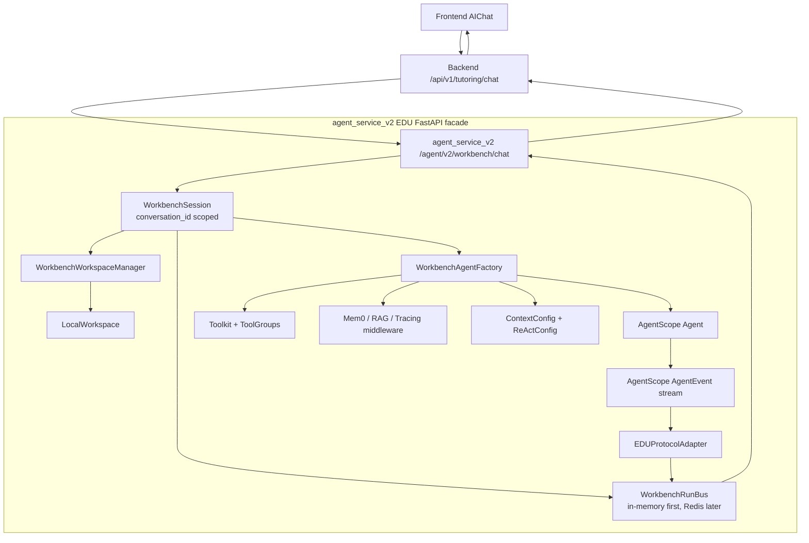
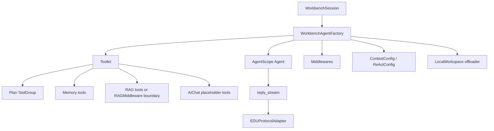
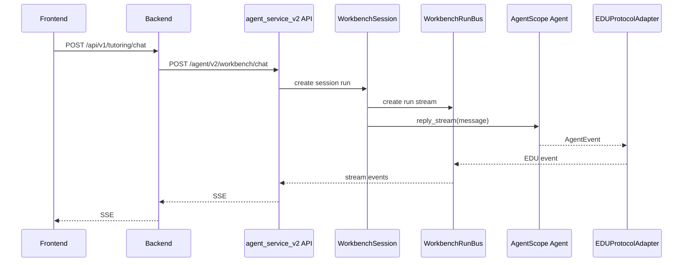

# AIChat Workbench v2 Agent Service-inspired Design

> 日期：2026-06-30  
> 状态：待审核  
> 范围：AIChat / AI 工作台作为下一阶段主线，`agent_service_v2` 采用 AgentScope 2.0.3 的 Agent Service 资源模型思想，但不直接由 `create_app` 承载整个服务。  
> 核心决策：选择方案 A。保留 EDU FastAPI facade，内部借鉴 AgentScope Agent Service 的 Session、MessageBus、WorkspaceManager、ProtocolMiddleware、RAG/KnowledgeBaseManager 等分工。

## 1. 设计立场

本阶段不直接采用 AgentScope `create_app(...)` 作为 `agent_service_v2` 主体。原因：

- EDU 已有 Backend 作为用户、课程、鉴权、会话、消息和业务持久化边界。
- 直接接入 `create_app` 会引入 AgentScope 官方用户、凭据、Agent、Session、Workspace、Schedule 等完整资源模型，迁移面过大。
- AIChat 当前需要先跑通一条 AgentScope-native 学习工作台链路，而不是重建平台级 Agent 管理后台。

但本阶段也不继续手写一套孤立 runtime。`agent_service_v2` 内部必须借鉴 AgentScope Agent Service 的核心分工：

- `Agent` 是可复用智能体模板。
- `Session` 承载一次会话的运行时状态，对应 Backend `conversation_id`。
- `WorkspaceManager` 为 session 分配隔离 workspace。
- `MessageBus` 负责事件流、重连缓冲和后续唤醒。
- `ProtocolMiddleware` / protocol adapter 负责把 AgentScope `AgentEvent` 转成外部协议。
- RAG / KnowledgeBaseManager 作为课程知识库边界。

## 2. 官方能力依据

本设计依据：

- Agent Service：`https://docs.agentscope.io/versions/2.0.3/zh/deploy/agent-service`
- Agent：`https://docs.agentscope.io/versions/2.0.3/zh/building-blocks/agent`
- Plan：`https://docs.agentscope.io/versions/2.0.3/zh/building-blocks/plan`
- RAG：`https://docs.agentscope.io/versions/2.0.3/zh/deploy/rag`

本地 AgentScope 2.0.3 已验证能力：

- `agentscope.app.create_app`
- `agentscope.app.storage.RedisStorage`
- `agentscope.app.message_bus.InMemoryMessageBus` / `RedisMessageBus`
- `agentscope.app.workspace_manager.LocalWorkspaceManager`
- `agentscope.app.middleware.ProtocolMiddlewareBase` / `AGUIProtocolMiddleware`
- `agentscope.agent.Agent`
- `agentscope.tool.TaskCreate` / `TaskGet` / `TaskList` / `TaskUpdate`
- `agentscope.middleware.Mem0Middleware` / `RAGMiddleware`

## 3. 总体架构



## 4. Agent Service 概念映射

| AgentScope Agent Service 概念 | EDU AIChat v2 映射 |
|---|---|
| Agent | `edu_ai_chat_workbench` agent template |
| Session | `WorkbenchSession`，映射 Backend `conversation_id` |
| Workspace | `LocalWorkspace`，由 `WorkbenchWorkspaceManager` 按 user/course/session 隔离 |
| Storage | 短期不替代 Backend MySQL；仅保存 Agent runtime 状态时再引入 |
| MessageBus | `WorkbenchRunBus`；第一阶段内存实现，后续可换 Redis |
| ProtocolMiddleware | `EDUProtocolAdapter`，输出 EDU SSE v2 |
| KnowledgeBaseManager | `WorkbenchRagBoundary`，后续接 AgentScope RAG service |
| Schedule | 第一阶段不启用 |
| ToolOffload | 后续用于长耗时工具，第一阶段只保留边界 |
| `create_app` | 暂不作为主服务入口，只作为中期迁移参考 |

## 5. 运行时对象

### `WorkbenchSession`

职责：

- 接收 Backend 传入的 `user_id`、`course_id`、`conversation_id`、`message`、`context`。
- 生成 `run_id`。
- 创建或恢复该 conversation 对应的 Agent runtime 状态。
- 获取 workspace。
- 启动 Agent run 并把事件写入 `WorkbenchRunBus`。

它不负责业务消息落库；业务会话与消息仍由 Backend 管。

### `WorkbenchRunBus`

借鉴 AgentScope MessageBus，但第一阶段不直接上 Redis：

- 管理单次 `run_id` 的事件流。
- 维护短期事件缓冲，支持 Backend SSE 读取。
- 后续可替换为 `RedisMessageBus` 以支持多进程和断线重连。

第一阶段可使用 in-memory bus，因为 `agent_service_v2` 还没有多实例部署。

### `WorkbenchWorkspaceManager`

借鉴 `WorkspaceManagerBase` / `LocalWorkspaceManager`。

隔离键：

```text
user_id + course_id/global + conversation_id
```

workspace 用途：

- AgentScope offload。
- RAG 上传临时文件。
- 中间 artifact 草稿。
- session 工具结果和大上下文文件。

workspace 不作为业务事实源。

### `EDUProtocolAdapter`

借鉴 AgentScope `ProtocolMiddlewareBase`，但输出 EDU SSE v2。

输入：

```text
AgentScope AgentEvent
```

输出：

```text
workflow_started
tool_started
tool_completed
tool_failed
source_refs
artifact_created
critic_completed
text_delta
workflow_completed
workflow_failed
```

Adapter 只做协议转换，不做业务决策。

## 6. Agent 设计



Agent 配置：

- `name`: `edu_ai_chat_workbench`
- `system_prompt`: 学习工作台角色、边界、工具使用原则、必须先规划再回答。
- `toolkit`: ToolGroups，而不是一个扁平工具列表。
- `middlewares`: `Mem0Middleware`、`RAGMiddleware`、tracing/budget middleware。
- `context_config`: 控制上下文压缩和工具结果长度。
- `react_config`: 限制 `max_iters`。
- `offloader`: session workspace。

## 7. Plan / Memory / RAG / Toolkit

### Plan

Plan 必须使用 AgentScope 内置工具：

- `TaskCreate`
- `TaskGet`
- `TaskList`
- `TaskUpdate`

任务状态由 AgentScope state / tasks context 管理。前端学习计划 artifact 可以从 plan tool 调用和最终输出派生，但第一阶段不把自定义 artifact 作为计划事实源。

### Memory

长期记忆优先 `Mem0Middleware`：

- `user_id` 使用 Backend 当前用户。
- `agent_id` 可包含 course scope，例如 `edu_ai_chat_workbench:{course_id}`。
- 配置不可用时显式返回 memory disabled 状态，不回退旧 `agent_service` memory。

### RAG

RAG 优先顺序：

1. `RAGMiddleware` 可满足上下文注入时，优先 middleware。
2. 需要前端展示检索过程时，再提供 `retrieve_course_context` 工具。
3. 后续接 AgentScope RAG service / KnowledgeBaseManager。
4. 旧 Qdrant 数据通过迁移或 connector 进入新 RAG 边界，不直接复用旧检索模块。

### Toolkit

使用 ToolGroups：

```text
planning
memory
rag
learning_state
artifact
review
```

第一阶段业务工具均为占位：

- `read_learning_state`
- `draft_study_artifact`
- `review_grounding`

占位工具返回结构化 observation，不返回 UI 文案。

## 8. 数据流



## 9. 第一阶段验收

- `agent_service_v2` 不使用旧 `agent_service/`。
- `agent_service_v2` 提供 EDU FastAPI facade，而不是直接暴露 AgentScope `create_app` 路由。
- 内部有 `WorkbenchSession`、`WorkbenchRunBus`、`WorkbenchWorkspaceManager`、`EDUProtocolAdapter` 边界。
- Agent 由 AgentScope `Agent` 驱动。
- Plan tools 进入 ToolGroup。
- Mem0 / RAG 以框架 middleware 或框架 service 边界接入。
- Backend / Frontend 契约不漂移。

