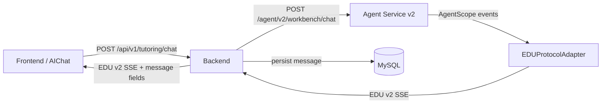
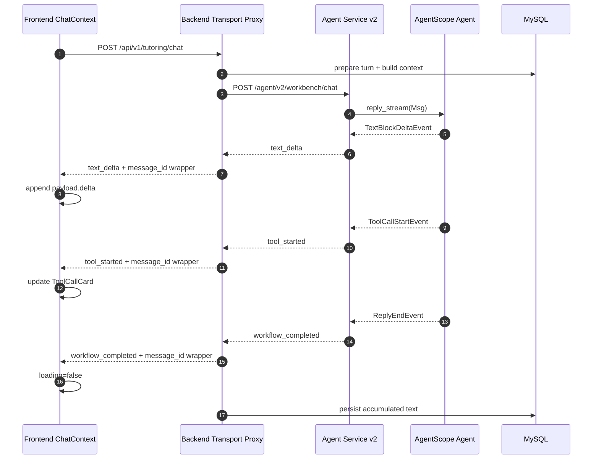

# AIChat 原生 EDU v2 事件协议设计

日期：2026-07-01

## 背景

当前 AIChat 已经通过 Backend 接入 `agent_service_v2`，但 Backend 仍把 Agent v2 的 EDU 事件转换成旧前端协议：

- `text_delta` -> `chunk`
- `workflow_completed` -> `done`
- `workflow_failed` -> `done(error)`
- `tool_started/tool_completed/artifact_created/source_refs` 被过滤

这让前端可以继续显示文本流，但它不是原生工作台协议。工具调用、工作区产物、RAG 引用和 Agent 状态无法自然进入前端状态。

本设计采用用户确认的方案 A：**前端原生消费 Agent v2 EDU 事件名，Backend 去除旧 `chunk/done` 兼容层**。

## 目标

1. 前端 `/ai-chat` 原生消费 EDU v2 事件。
2. Backend 保持前端到 Agent Service 的唯一 HTTP 边界，不让前端直连 Agent Service。
3. Backend 不再把 v2 事件降级成旧协议，也不承担 Agent 语义转换；只做转发、最小 envelope 包装、鉴权上下文与持久化。
4. Agent v2 继续使用 AgentScope 2.x `Agent.reply_stream()` 作为分块事件来源。
5. 工具事件、产物事件、引用事件可以进入前端 `ToolCallCard` 和 `AgentWorkspace`。

## 非目标

1. 本阶段不接入完整 RAG / Memory middleware。
2. 本阶段不删除旧 `agent_service/` 目录。
3. 本阶段不改前端直连 Agent Service。
4. 本阶段不设计双协议开关。
5. 本阶段不重做 AIChat 页面视觉布局。

## 边界原则



Backend 仍是权限、会话、持久化和上下文组装边界。去除兼容层不等于前端直连 Agent Service。

AgentScope event 到 EDU v2 event 的语义适配固定在 Agent Service v2 内部完成，具体边界是 `agent_service_v2/runtime/protocol_adapter.py`。Backend 不解释 AgentScope 内部事件，不推断工具语义，不生成工作台 artifact；Backend 只处理传输层和 Backend 自己拥有的业务 envelope。

## 事件契约

Frontend 应直接处理以下 EDU v2 事件：

| 事件 | 来源 | 前端动作 |
| --- | --- | --- |
| `workflow_started` | Agent v2 | 标记 assistant message 开始运行，可记录 `run_id` |
| `text_delta` | AgentScope `TextBlockDeltaEvent` | 追加 `payload.delta` 到 assistant content |
| `tool_started` | AgentScope `ToolCallStartEvent` | 新增或更新 `message.toolCalls` 为 running |
| `tool_completed` | AgentScope `ToolResultEndEvent` | 更新对应 tool call 为 completed/success |
| `tool_failed` | Agent v2 adapter | 更新对应 tool call 为 error |
| `source_refs` | RAG/Tool 后续事件 | 写入 assistant message references |
| `artifact_created` | Tool/Agent 后续事件 | 写入 `workspaceArtifacts` |
| `critic_completed` | Review/grounding 后续事件 | 写入 review/grounding 状态 |
| `workflow_completed` | AgentScope `ReplyEndEvent` | 停止 loading，绑定 `message_id`/`conversation_id` |
| `workflow_failed` | AgentScope failure / service failure | 停止 loading，显示错误态 |

### Backend 补字段规则

Agent v2 事件原始 envelope 保留：

```json
{
  "type": "text_delta",
  "run_id": "run_xxx",
  "conversation_id": "conv_xxx",
  "seq": 2,
  "timestamp": "2026-07-01T...",
  "agent": "edu_ai_chat_workbench",
  "payload": {
    "delta": "..."
  }
}
```

Backend 可补充或覆盖以下业务字段：

```json
{
  "conversation_id": "backend_conversation_id",
  "message_id": "backend_assistant_message_id"
}
```

补字段应保持在顶层，避免污染 Agent v2 `payload`。

## Backend 设计

### 当前问题

`TutoringStreamAdapter` 当前承担了不该继续保留的旧协议转换：

- 解析 Agent v2 SSE。
- 将 `text_delta` 转成 `chunk`。
- 将 `workflow_completed` 转成 `done`。
- 过滤工具与 artifact 事件。
- 通过累积文本持久化 assistant message。

### 新职责

`TutoringStreamAdapter` 改为 EDU v2 transport proxy，不再是语义 adapter：

1. 继续请求 `/agent/v2/workbench/chat`。
2. 继续构造 Workbench payload，把 Backend 上下文放入 `context`。
3. 解析每个 Agent v2 SSE event。
4. 对 `text_delta` 累积 `payload.delta` 用于持久化。
5. 对每个合法 EDU v2 event 补顶层 `conversation_id` 和 `message_id`。
6. 原样输出事件名，不再输出 `chunk/done`。
7. Agent Service 不可用时输出 `workflow_failed`，而不是 `done(error)`。

Backend 明确不做以下事情：

- 不把 Agent v2 事件重新命名成 Client 专用事件。
- 不把工具事件翻译成 UI 状态。
- 不根据 payload 推断 artifact 类型。
- 不读取或暴露 AgentScope 原始对象。
- 不承担 `source_refs`、`artifact_created`、`critic_completed` 的生成职责。

这些语义都属于 Agent Service v2 的 EDUProtocolAdapter、工具、middleware 或后续 Agent runtime 扩展。

### Backend 输出示例

```json
{
  "type": "workflow_failed",
  "run_id": null,
  "conversation_id": "conv_1",
  "message_id": "msg_1",
  "seq": null,
  "timestamp": "2026-07-01T...",
  "agent": "backend_proxy",
  "payload": {
    "reason": "agent_service_unavailable",
    "message": "Agent 服务暂时不可用"
  }
}
```

## Frontend 设计

### chatService

`chatService.streamChat()` 不再识别业务事件类型。它只做：

1. 发起 `POST /api/v1/tutoring/chat`。
2. 解析 SSE `data:` 行。
3. `JSON.parse` 后把完整 event 交给 `onMessage(event)`。
4. 网络错误交给 `onError(error)`。

`onDone` 的业务语义应移除。`workflow_completed` 和 `workflow_failed` 都作为普通 EDU v2 event 进入 `onMessage(event)`，由 `ChatContext` 的 event reducer 统一完成 loading、错误态、message id 绑定和 session 刷新。

### ChatContext

`ChatContext` 成为 EDU v2 event reducer，核心处理：

| 事件 | 状态变更 |
| --- | --- |
| `workflow_started` | assistant message 保持 loading，记录 run_id |
| `text_delta` | `content += payload.delta` |
| `tool_started` | upsert `toolCalls[tool_call_id]` status=`running` |
| `tool_completed` | 更新 tool call status=`completed` |
| `tool_failed` | 更新 tool call status=`error` |
| `artifact_created` | append 到 `workspaceArtifacts` |
| `source_refs` | append 到 assistant message source refs |
| `critic_completed` | 写入 review/grounding 状态 |
| `workflow_completed` | loading=false，绑定 message_id，刷新 sessions |
| `workflow_failed` | loading=false，isError=true，展示 payload.message/reason |

### workspaceArtifacts 格式

前端工作区使用现有 `PluginRegistry`。`artifact_created` 的推荐 payload：

```json
{
  "artifact": {
    "id": "artifact_xxx",
    "type": "Markdown",
    "props": {
      "content": "..."
    }
  }
}
```

如果 Agent v2 暂时无法产生 artifact，前端 reducer 仍应支持该事件，测试可用 synthetic event 覆盖。

## Agent v2 设计

Agent v2 继续作为 EDU v2 事件源。当前已支持：

- `ReplyStartEvent` -> `workflow_started`
- `TextBlockDeltaEvent` -> `text_delta`
- `ToolCallStartEvent` -> `tool_started`
- `ToolResultEndEvent` -> `tool_completed`
- `ReplyEndEvent` -> `workflow_completed`
- `ExceedMaxItersEvent` -> `workflow_failed`

需要补齐的 AgentScope delta 事件策略：

| AgentScope event | EDU v2 处理 |
| --- | --- |
| `ToolCallDeltaEvent` | 可忽略或聚合为 tool input preview；本阶段优先忽略 |
| `ToolResultTextDeltaEvent` | 可映射为 `tool_completed` 的 result preview；本阶段可忽略 |
| `ToolResultDataDeltaEvent` | 后续用于 `artifact_created`；本阶段只保留 adapter 扩展点 |
| `DataBlockDeltaEvent` | 后续用于 structured data/artifact；本阶段只保留扩展点 |
| `ThinkingBlockDeltaEvent` | 默认不透出给前端，避免暴露推理细节 |

本阶段不直接向前端暴露 AgentScope 原始对象，只暴露稳定 EDU v2 事件。

## 数据流



## 错误处理

1. Agent Service HTTP 失败：Backend 输出 `workflow_failed`。
2. Agent v2 正常返回 `workflow_failed`：Backend 补业务字段后透传。
3. SSE JSON 解析失败：前端忽略该行并记录 console error。
4. 网络 abort：前端不显示错误，只停止当前 fetch。
5. 持久化失败：Backend 记录日志；前端已收到的事件不回滚。

## 测试策略

### Backend

替换 `tests/test_tutoring_stream_adapter.py` 中旧断言：

- 不再期望 `/agent/v2/workbench/chat` 输出被转成 `chunk/done`。
- 期望 `text_delta` 原样输出并补 `message_id`。
- 期望 `workflow_completed` 原样输出并补 `message_id`。
- 期望 `tool_started/tool_completed/artifact_created/source_refs` 不被过滤。
- 期望 AgentServiceError 输出 `workflow_failed`。
- 继续验证文本累积持久化。
- 明确断言 Backend 不重命名事件、不生成 artifact、不改写 Agent v2 `payload`。

### Frontend

更新 `ChatContext` 和 `chatService` 测试：

- `text_delta` 追加文本。
- `workflow_completed` 停止 loading 并绑定 message id。
- `workflow_failed` 显示错误态。
- `tool_started/tool_completed/tool_failed` 更新工具卡片状态。
- `artifact_created` 写入 `workspaceArtifacts`。
- 旧 `chunk/done` mock 流改为 EDU v2 mock 流。

### Agent v2

保留现有 Agent v2 测试，并补充：

- adapter 对新增 AgentScope delta event 不误报 `workflow_failed`。
- `workflow_failed` envelope 可被 Backend 透传。

## 迁移步骤

1. 先改 Backend tests 为 EDU v2 原生事件期望，并断言 Backend 只做 transport proxy + envelope wrapper。
2. 改 `TutoringStreamAdapter` 为 pass-through transport proxy。
3. 改 Frontend tests 为 EDU v2 事件期望。
4. 改 `chatService` 为 SSE JSON 透传。
5. 改 `ChatContext` 为 EDU v2 reducer。
6. 补 Agent v2 adapter 对更多 delta event 的安全处理。
7. 运行 Backend、Agent、Frontend 验证。

## 验收标准

1. 浏览器 Network 中 `/api/v1/tutoring/chat` SSE event 类型不再出现 `chunk/done`。
2. 文本流由 `text_delta` 驱动并正常显示。
3. 流结束由 `workflow_completed` 驱动，assistant message 停止 loading。
4. 失败由 `workflow_failed` 驱动，前端显示错误态。
5. `tool_started/tool_completed/tool_failed` 可以驱动 `ToolCallCard`。
6. `artifact_created` 可以写入 `AgentWorkspace`。
7. Backend 仍能持久化 assistant message 文本。
8. 前端不直连 Agent Service。

## 风险与取舍

- 一次性切换会要求前后端测试同步更新，但能彻底移除旧兼容层。
- 前端会更直接绑定 EDU v2 事件名；这是本阶段的目标，不再额外抽象成产品化 Client 事件名。
- Artifact/RAG/Memory 的真实业务能力仍依赖后续 Agent tools 和 middleware 实现；本阶段先打通协议承载能力。
- Backend 保持薄代理会让前端更依赖 EDU v2 event envelope；这是为了遵守 AgentScope runtime 边界，避免在 Backend 形成第二套伪 adapter。
