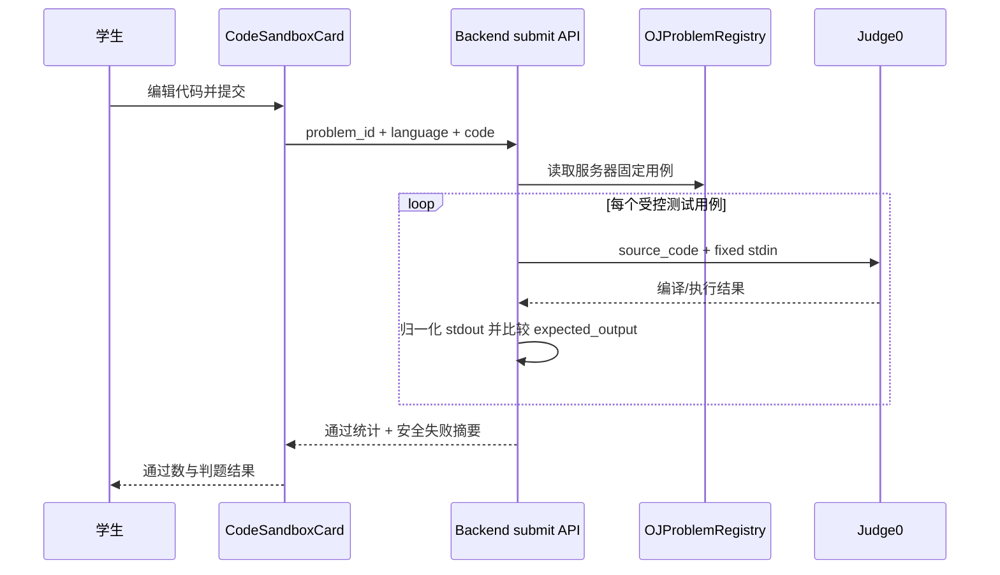

# 固定用例 OJ 判题设计

日期：2026-07-10

## 1. 问题与目标

现有 `CodeSandboxCard` 将浏览器中可编辑的 `stdin` 直接提交至
`POST /api/v1/sandbox/execute`。Judge0 只能返回编译或单次执行状态，
没有题目标准答案，也无法判定学生是否完成题目。因此它是运行沙箱，不是
LeetCode 式的题目评测。

本设计将学生侧卡片升级为固定测试用例判题：学生只编辑代码；服务端按题目
标识读取预设测试用例，逐例执行并比对标准输出。公开样例可展示输入、期望
输出和实际输出；隐藏用例仅返回通过/未通过，绝不返回其输入或期望输出。

第一期只支持命令行标准输入/标准输出题，不实现 LeetCode 的函数签名、对象
序列化和跨语言 adapter。这样能复用当前 C/C++/Python/Java/Go/JavaScript
运行模型，且不把语言运行时细节散落到前端。

## 2. 方案比较与选择

### 方案 A：浏览器传入固定用例

卡片持有测试用例，前端循环请求 Judge0 并自行比较输出。

- 优点：实现快、界面直接。
- 缺点：隐藏用例会暴露在浏览器，结果可被篡改，不能作为判题事实。
- 结论：不采用。

### 方案 B：后端静态题目注册表（第一期采用）

后端维护小型题目注册表；每题含允许语言、公开样例、隐藏用例和期望输出。
卡片只提交 `problem_id`、代码和语言。后端按受限并发运行用例并归一化比较
输出。

- 优点：隐藏用例不离开服务端；无需数据库迁移；能尽快把现有 OJ 卡片变成
  可演示的自动判题。
- 缺点：题目须由代码注册，管理员不能自行维护；Agent 只能生成已注册题目的
  卡片，不能安全地即时生成任意新题。
- 结论：采用，作为可控 MVP。

### 方案 C：数据库题库与管理端维护

新增题目、测试用例与语言模板的数据模型，并提供教师/管理员维护流程。

- 优点：可扩展为真正的题库和个性化练习资源。
- 缺点：涉及数据结构、权限、管理 UI 和迁移，超出本次 OJ 交互优化范围。
- 结论：作为方案 B 稳定后的第二阶段，不在本次实现。

## 3. 架构与数据流



边界保持不变：前端仅访问 Backend；Backend 调用 Judge0；Agent Service 仍只能
经 Backend 使用 `run_code_in_oj`。学生评测不经过 Agent，也不写入 MySQL。

## 4. 契约设计

新增学生提交接口，不改变现有调试运行接口：

`POST /api/v1/sandbox/submit`

请求体：

```json
{
  "problem_id": "sum-two-integers-v1",
  "language": "python",
  "code": "..."
}
```

`stdin` 不再由学生接口接收。`/api/v1/sandbox/execute` 保留给既有调试及 Agent
运行能力，不再由新版 `CodeSandboxCard` 调用。

成功响应 `data` 固定包含：

```json
{
  "problem_id": "sum-two-integers-v1",
  "status": "accepted",
  "passed_cases": 4,
  "total_cases": 4,
  "failed_case": null
}
```

失败时 `status` 可为 `wrong_answer`、`compilation_error`、`runtime_error`、
`time_limit_exceeded`、`internal_error` 或 `degraded`。`failed_case` 仅在公开样例
失败时包含 `input`、`expected_output`、`actual_output`；隐藏样例仅包含
`visibility: "hidden"` 和通用提示。编译和运行错误沿用现有诊断字段。

未知题目或题目不支持该语言返回 400；未认证仍为 401；Judge0 不可用保持 200
并返回 `degraded`，不把“无法判题”伪装为答错。

## 5. 工件与前端设计

新的 `CodeSandboxCard` 最小 props 为：

```json
{
  "problem_id": "sum-two-integers-v1",
  "question_text": "读取两个整数并输出它们的和。",
  "code": "...",
  "language": "python"
}
```

`default_stdin` 退出新版必填契约。为避免历史会话里的卡片无法渲染，工件校验
短期兼容旧字段；但旧卡片显示“旧版自由运行模式”，不参与固定用例判题。

新版卡片移除 stdin 文本框，改为：

- 公开样例区：展示题干预设的输入和期望输出；
- 提交按钮：文案为“提交判题”；
- 结果区：显示通过数、运行资源消耗和首个失败的安全摘要；
- “请求 AI 答疑”：向 AI 传递题目、代码和判题摘要；隐藏用例的内容不进入 prompt。

前端不保存或比较隐藏用例，也不根据浏览器输入推导 verdict。

## 6. 后端实现边界

新增 `OJProblemRegistry`（纯服务层）与 `OJSubmissionService`：

- 注册表保存不可变 `problem_id`、允许语言、测试用例、公开/隐藏标记和期望输出；
- 服务层校验问题和语言，调用现有 `execute_code_in_oj`；
- 用例按小并发度执行，避免一个提交压垮 Judge0；首次编译/运行级失败可停止后续执行；
- 文本对比统一换行符，并忽略每行末尾空白及末尾空行；其余字符必须精确相同；
- Router 只负责鉴权、请求校验和成功包装。

不引入新第三方依赖，不修改 MySQL schema，不把隐藏用例传给 Agent 或前端。

## 7. 验收与测试

采用 TDD：先为新接口和服务层写失败测试，再实现。

后端至少覆盖：

1. 完全通过、公开样例错误、隐藏样例错误；
2. 编译错误、运行错误和 Judge0 降级；
3. 未认证、未知 `problem_id`、不支持语言；
4. 隐藏用例输入/期望输出不会出现在响应或日志摘要。

前端至少覆盖：

1. 新卡片没有可编辑 stdin；
2. 提交 payload 只含 `problem_id`、`language` 和 `code`；
3. 公开与隐藏失败的展示差异；
4. AI 答疑 prompt 不泄露隐藏测试数据；
5. 旧 `default_stdin` 卡片保持可读的降级展示。

完成后运行相关 pytest、Agent OJ 回归、前端单测、lint 和 production build，并同步
更新 Client OpenAPI、前端接口规范、WorkLine。该接口新增属于 Client API 契约漂移；
Agent API 路径无漂移。

## 8. 非目标与后续

- 本期不写入提交历史、排行榜或掌握度；
- 本期不实现函数签名型 LeetCode runner；
- 本期不让 LLM 动态定义隐藏用例；
- 第二期可将静态注册表迁移为数据库题库，并接入教师端、资源生成与个性化推荐。
