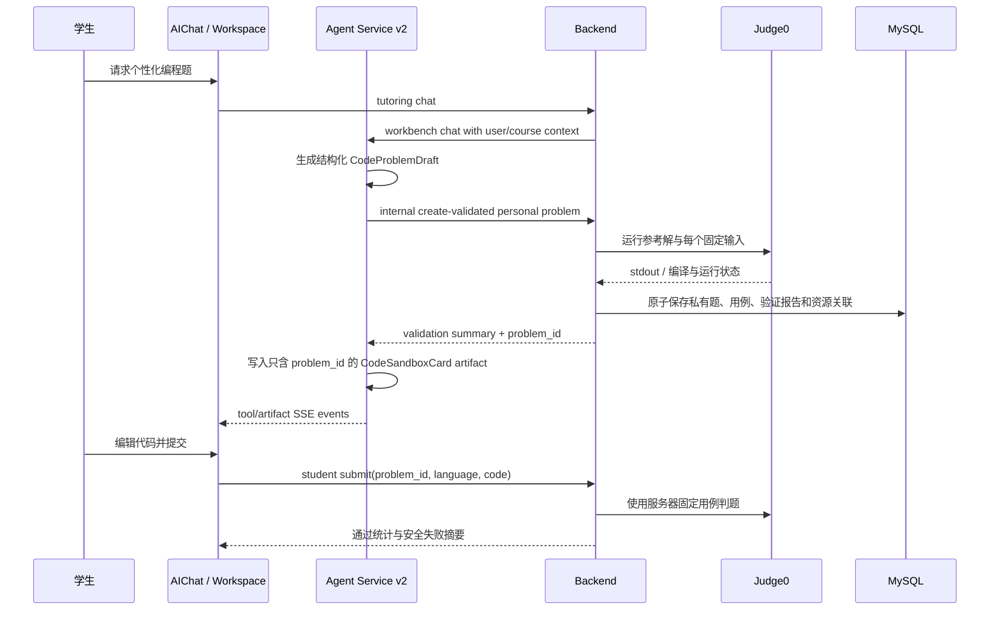

# AIChat 私有代码题资源与固定用例判题设计

日期：2026-07-10

## 1. 决策与范围

学生在 AIChat 请求生成编程题时，产物属于该学生的私有学习资源，不进入课程
公共题库。管理员通过既有 Agent v1 资源生成链路创建的通用资源，仍维持课程
级归属；未来迁移到 Agent v2 时复用本设计的验证和判题领域能力，而不复用
学生私有资源的可见性策略。

本设计实现学生侧的最小闭环：AIChat 生成题目草案，受限工具用 Judge0 验证
参考解与固定测试输入，Backend 在验证成功后持久化私有代码题，工作区卡片按
`problem_id` 读取公开信息并提交判题。

不包含管理员 UI、公共题库发布、排行榜、提交历史、学习掌握度写回，以及
函数签名型 LeetCode runner。本期支持命令行标准输入/标准输出题。

此前的“固定注册表”方案只适用于演示样例；本设计取代它作为学生 AIChat 题目
的实现方案。

## 2. 架构选择

### 方案 A：仅保存 AIChat workspace 工件

题干、代码和用例写进 run workspace，并在消息 `meta_json` 保留展示快照。

- 优点：无需数据模型变更。
- 缺点：无稳定题目 ID，测试用例无法安全保存或复用，无法在个性化资源页检索。
- 结论：不采用；该机制只保留为会话展示层。

### 方案 B：所有 AIChat 题目直接存为公共资源

- 优点：实现时可直接使用现有课程资源列表。
- 缺点：违背学生私有归属，会污染课程资源，并把未审核个性化内容暴露给他人。
- 结论：不采用。

### 方案 C：私有代码题领域模型 + 共用验证/判题服务（采用）

代码题、测试用例和验证报告由 Backend 持久化。`owner_user_id` 非空的记录只
能由该学生读取或提交；将来管理员通用题可使用相同模型和验证服务，但其
`owner_user_id` 为空并走独立发布权限。

- 优点：固定测试用例留在服务端；可连接现有个性化资源列表；验证、判题和
  资源生成可复用；不会把学生内容错误公开。
- 成本：需要新增表、内部 API、学生 API 和 Agent v2 typed tool。
- 结论：采用。

## 3. 责任边界与流程



Frontend 只经 Backend 访问资源和判题；Agent Service 不写 MySQL，也不直连
Judge0；Backend 不导入 Agent Python 模块。AgentScope 仅负责在 AIChat 中选择
受限工具、流式输出和事件产生；领域协议仍由 Backend 定义。

## 4. 数据模型

新增 `code_problems`：

- `id`、`course_id`、`owner_user_id`（学生私有题必填）；
- `origin`（本期固定为 `ai_chat`）、`conversation_id`、`run_id`，用于可追溯；
- `title`、`statement`、`chapter`、`knowledge_point`、`difficulty`；
- `language`、`starter_code`、`reference_solution`（本期每题只支持一种语言；
  参考解只服务端使用，绝不返回学生）；
- `validation_report` JSON、`status`（本期成功后固定为 `validated`）；
- 通用审计字段与软删除字段。

新增 `code_problem_test_cases`：

- `id`、`problem_id`、`ordinal`、`stdin`、`expected_output`、`is_public`；
- `expected_output` 必须来自 Judge0 执行参考解的实际 stdout，不采信模型自行
  声称的答案；
- 表中所有用例只可由服务端读取。学生详情接口只投影公开用例；提交接口对隐藏
  用例仅返回匿名失败摘要。

扩展 `user_personalized_resources` 增加 nullable `code_problem_id` 外键。这样私有
代码题延续当前个性化资源页的用户/课程查询和软删除语义，但不塞进
`quiz_questions` 或课程公共 `resources`。

本期不创建公共题目：管理员通用题未来复用 `code_problems`、测试用例和验证
服务，但通过 `owner_user_id = null` 与课程发布状态实现权限，不读取学生私有题。

新增的表和列必须通过 `backend/migrations/` 中的手写 SQL migration 部署；修改
`schema.sql` 与 ORM 只服务于新环境和测试，不能替代对已有 MySQL 实例的迁移。

## 5. 验证与保存事务

AI 先在 Agent 工作区形成结构化草案。草案包含题干、学习标签、单一目标语言、
该语言 starter code、服务端参考解，以及标记为公开或隐藏的测试输入；草案不能
携带权威期望输出。

Agent v2 使用一个有副作用的 typed tool：
`create_validated_personal_code_problem`。它表示一个不可拆开的业务事务，而非
手写 agent workflow：

1. Backend 校验草案字段、大小、语言白名单、用例数量、输入重复和公开用例数量；
2. 对该题目标语言至少运行一组公开和一组隐藏输入；参考解编译、运行或超时
   失败则拒绝保存；
3. Backend 将参考解 stdout 归一化后写为期望输出，并保存验证报告；
4. 所有检查成功时，在同一数据库事务内保存题目、用例和
   `UserPersonalizedResource` 关联；否则不留下部分题目；
5. tool 返回 `problem_id`、公开用例数量、隐藏用例数量、目标语言和安全验证
   摘要，不返回参考解或隐藏输入/输出。

该工具通过 service-token 保护的 Backend internal API 调用。Backend 除了验证
service token，还必须验证 `conversation_id` 归属该 `user_id`，且该学生属于
`course_id`；服务端不得仅信任 Agent 传来的三元组。该工具必须加入
Workbench 的允许工具列表，且只允许使用当前 chat run 的 `user_id`、`course_id`
和 `conversation_id`；模型不得指定任意用户或课程。

该 tool 的输入含参考解与隐藏用例，因此 `AgentRunLoggingMiddleware` 必须对
`create_validated_personal_code_problem` 使用专用安全投影：只记录 tool 名、语言、
题目字符数、公开/隐藏用例数量和结果状态。不得写入原始 tool input、tool output、
run 事件文件或 `debug_log` SSE。

本期不引入额外 Critic agent。运行验证能保证“参考解与保存的预期输出一致”，
但不声称已证明题干语义完全正确；AIChat 应把题目说明为“已完成运行验证”。
后续可增加独立的语义审阅工具，而不改变存储和判题契约。

## 6. 学生 API 与判题契约

新增 Client API：

1. `GET /api/v1/sandbox/problems/{problem_id}`：仅题目 owner 可读；返回题干、
   starter code、目标语言和公开样例，不返回参考解或隐藏用例。
2. `POST /api/v1/sandbox/problems/{problem_id}/submit`：仅题目 owner 可提交；
   请求仅含 `language` 与 `code`，不含 `stdin`，响应为 `202` 和
   `data.task_id`。

前端用既有 `GET /api/v1/tasks/{task_id}` 轮询状态。Backend 创建
`AsyncTask(task_type="code_problem_judging")` 后后台执行判题；它是技术性进度
记录，不是学生提交历史领域模型。服务重启时，`code_problem_judging` 必须被既有
孤儿任务恢复逻辑标记为失败，不能永久停留在 `processing`。

判题后台服务从 `code_problem_test_cases` 读取所有固定用例，通过 Judge0
`/submissions/batch` 创建 batch，再轮询 `/submissions/batch` 获取结果；不依赖
`wait=true`。服务端限制同一学生的在途判题数，并限定 batch 大小、轮询间隔和
总等待时间。输出归一化规则为：统一换行符，忽略每行末尾空白和末尾空行，其余
字符完全匹配。

最终 task `result` 返回 `accepted`、`wrong_answer`、`compilation_error`、`runtime_error`、
`time_limit_exceeded`、`internal_error` 或 `degraded`。返回中总是包含通过数和
用例总数；公开用例失败可返回输入、期望和实际输出，隐藏用例失败只返回
`visibility: "hidden"` 与通用描述。OJ 不可用返回 `degraded`，不能伪装为答错。

保留既有 `POST /api/v1/sandbox/execute` 和
`POST /internal/ai-chat/oj/evaluate`：它们仍是自由 stdin 的调试/Agent 运行工具，
不被新版学生判题卡调用。

## 7. AIChat 工件与 SSE

新版 `CodeSandboxCard` artifact 只含：

```json
{
  "type": "CodeSandboxCard",
  "props": {
    "problem_id": "<private-id>",
    "language": "python"
  }
}
```

卡片通过 student API 获取题干、公开样例与 starter code；前端不从 artifact 或聊天
消息接收测试用例。它移除 stdin 编辑框，提交后轮询 task，展示“判题中”、通过数
和安全失败摘要。“请求 AI 答疑”只传题干、学生代码和安全判题摘要。

历史 `default_stdin` card 保持自由运行模式的只读兼容，不迁移或伪装为固定用例题。

AgentScope 2.0.3 的 `ToolGroup` 和现有 `reply_stream()` 持续作为运行机制。
通过现有 adapter 输出 `tool_started`、`tool_completed`、`artifact_created` 和
`workflow_completed`，不向 Client API 泄露 AgentScope 对象。tool 完成 payload
记录验证数量、保存结果和降级原因；不包含隐藏测试数据。

## 8. 管理员资源生成的复用边界

管理员现有 Agent v1 通用资源生成不在本次迁移范围。后续为管理员生成代码题时，
应复用 Backend 的草案验证、用例持久化、详情读取和学生判题服务；它使用课程
通用归属与管理员发布权限，而不是复用学生 AIChat 的 `UserPersonalizedResource`
关联或私有访问校验。

Agent v1 → v2 的编排迁移只替换调用方：v1 的资源 workflow 和 v2 的 Workbench
tool 都调用同一个 Backend 领域服务。不得把 Agent 逻辑复制进 Backend，也不得
为了迁移而改变学生判题的 Client API。

## 9. 测试与验收

先写失败测试，再实现。

Backend：

1. SQL migration 可安全应用到已有库；验证成功原子保存；参考解编译失败、运行失败、用例重复、语言不支持时不落库；
2. 详情和提交仅允许题目 owner；其他学生、教师与管理员不能读取私有题；
3. 公开失败与隐藏失败返回不同投影；响应、Agent tool 摘要和日志均不泄露隐藏数据；
4. batch 提交、轮询、总超时、服务重启恢复、接受、答错、编译错误、运行错误和 OJ 降级；
5. `UserPersonalizedResource` 列表能关联并显示私有代码题。

Agent v2：

1. typed tool 正确附带当前 run 的用户、课程、会话上下文，且日志/SSE 不含草案秘密；
2. tool 成功、拒绝和 Backend 不可用的结构化结果；
3. workbench tool group、权限和 EDU SSE 摘要回归。

Frontend：

1. 新卡片无 stdin 文本框，读取公开详情并以题目 ID 提交；
2. 判题结果对公开/隐藏失败进行安全展示；
3. AI 答疑 prompt 不包含隐藏数据；
4. 历史自由运行卡片仍可渲染；
5. 个性化资源页能跳转或打开私有代码题。

完成时运行相关 pytest、Agent v2 测试、前端单测、lint 和 build；更新 Client
OpenAPI、前端接口规范、Agent 内部接口规范与 WorkLine。Client API 与 Backend
internal API 均发生新增契约；Agent v2 外部 `/agent/v2` 路径无新增。

## 10. 非目标

- 不新增学生提交历史、排行榜或自动更新掌握度；`AsyncTask` 仅保存完成判题所需的短期技术结果；
- 不实现题目分享、学生私有题转公共题，或管理员审核学生题；
- 不实现动态用例生成、函数签名 runner 或 unbounded 代码执行；
- 不修改旧 Agent v1 通用资源生成的当前行为。
